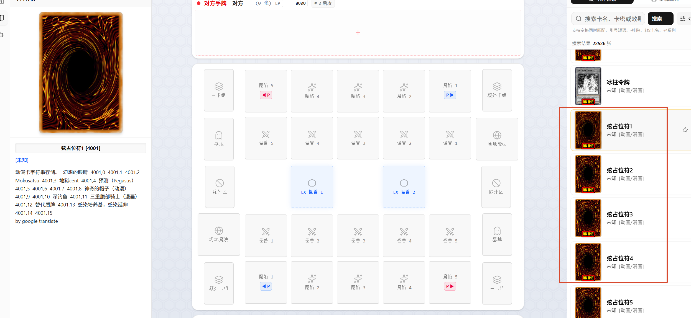
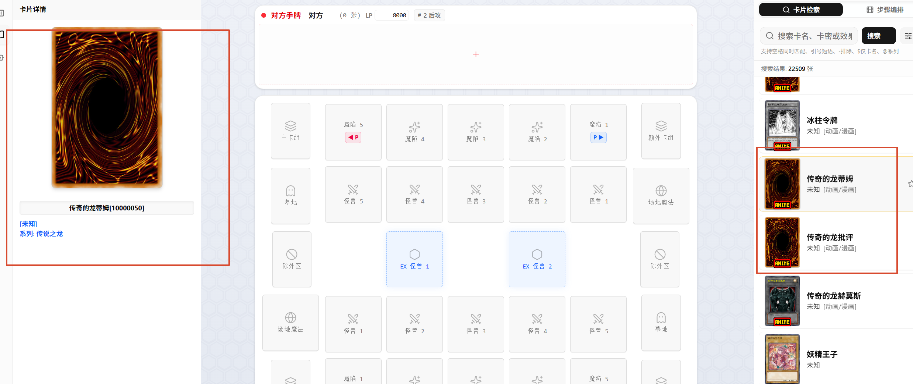
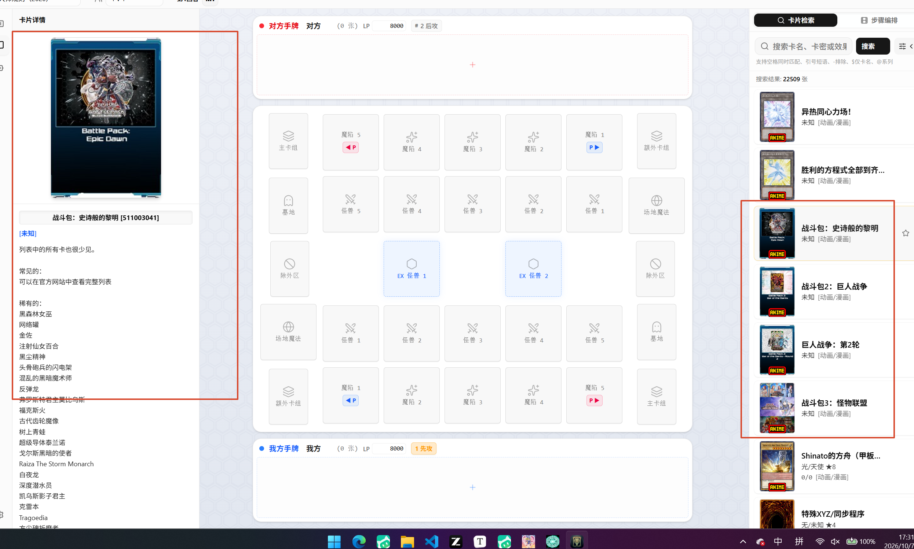

# EDOPro 数据源中的「非卡牌」条目

## 现象

检索卡池时，会出现一批「没有卡图、描述看不懂、类型显示 `[未知]`」的条目，例如：

- **弦占位符1 ~ 弦占位符17**（anime.cdb，id 4001~4017）
- **传奇的龙蒂姆 / 传奇的龙批评 / 传奇的龙赫莫斯**（anime.cdb，id 10000050/60/70）
- **战斗包：史诗般的黎明 / 战斗包2：巨人战争 / 巨人战争：第2轮 / 战斗包3：怪物联盟**（anime.cdb，id 511003041~44）
- **妖精王子 / 不明**（ygopro 主库，id 19144623 / 77571455）

这些都不是可用的卡牌实体，而是 EDOPro / ygopro 数据里的**残留行**，分属几类不同来源。



## 类型一：字符串资源行（「占位符」）

EDOPro 在 `anime.cdb` 里塞的**多语言文本索引表**，用来存卡名/效果的翻译字符串。

以 `弦占位符1`（id 4001）为例：

| 字段 | 值 |
| --- | --- |
| `datas.type` | `16384` = `0x4000`（TOKEN 位） |
| `texts.name` | `弦占位符1` |
| `texts.desc` | `动漫卡字符串存储。  幻想的眼睛  4001,0  4001,1  4001,2 ...` |
| 卡图 | 不存在 |

`desc` 里那串 `4001,0 4001,1 ...` 是**字符串索引表**（「卡名索引,字段索引」），EDOPro 靠它把同一张卡的不同语言文本按索引查出来。整行就是一张「字库指针表」。

## 类型二：残缺的动画卡条目（「传奇的龙」）



id 段 `10000050~10000070`，三条「传奇的龙」系列。特征是：

| 字段 | 值 |
| --- | --- |
| `datas.type` | `16384` = `0x4000` |
| `datas.ot` | `3`（OCG + TCG） |
| `datas.atk` / `def` / `level` | 全 `0` |
| `texts.desc` | **空** |
| 卡图 | 蒂姆/批评无图，赫莫斯有图 |

因为 `type` 里没有任何怪兽/魔法/陷阱大类位（`type & 7 = 0`），也没有攻防等级，界面只能显示 `[未知]`、描述空白 —— 是**功能未实现、资料残缺**的占位条目。

## 类型三：产品说明被塞进 desc（「战斗包」）



id 段 `511003041~511003044`，`type = 16400`（`0x4010`），`ot = 8`。特征是把**实体卡包的商品介绍**当成了卡牌效果文：

```
这只是战斗包2：巨人战争的扩展。如果仅选择此组合，请合并该集合的内容和Battle Pack 2：巨人战争。

常见的：
Evilswarm Heliotrope
大眼睛
Otohime
...
```

同样是 `type & 7 = 0`、无攻防等级、无有效卡图。

## 排除「衍生物 / 令牌」（TOKEN 位）

`datas.type` 的 `0x4000`（16384）位是 ocgcore 的 **TOKEN** 标记，游戏内所有「衍生物 / 令牌」条目都带这一位。用户明确要求：**搜索界面不再返回它们**，因为决斗场上有微调面板可以直接快速添加衍生物，无需在检索里找到。

统计（带 TOKEN 位的条目）：

| 卡库 | TOKEN 位总数 | 名含「衍生物 / 令牌」 | 其他 |
| --- | --- | --- | --- |
| `ygopro/cards.cdb` | 265 | 263 | 2（即「妖精王子」「不明」） |
| `anime.cdb` | 172 | 84 | 88（含「No.1 衍生物」「时械神·亚纳尔衍生物」等命名不含「衍生物」的令牌） |

**这一位是精确的令牌标识** —— 除上述 2 条残留行外，凡是带 TOKEN 位的都是真正的衍生物/令牌。所以用 `(d.type & 16384) = 0` 一次排除即可，比按名字匹配「衍生物」更全（能覆盖 anime 库里 88 条命名不含「衍生物」的令牌）。

注意：**名为「衍生物收集者 / 衍生物复活祭 / 衍生物谢肉祭」等是真卡**（怪兽/魔法/陷阱，不带 TOKEN 位），必须保留 —— 这也是不能用「名称含衍生物」来过滤的原因。

## 不能用的判断方式（会误杀）

- **「按名称含『衍生物』过滤」会误杀真卡**：「衍生物收集者」（怪兽）、「衍生物复活祭 / 收获祭 / 谢肉祭 / 诞生祭」（魔陷）名字里都有「衍生物」，但都是正式卡。
- **「`desc` 含 `by google translate` 就过滤」会误杀 275 条**（含「冰柱令牌」等真卡）。
- **「无卡图就过滤」会误杀 36 条合法卡**（Pre-Errata 旧文本版如「旧实体诺登」「破灭龙 甘多拉·交错」、GOAT 格式卡、自制动画卡「神智顶部(Anime)」等 —— 它们只是缺图片文件，卡牌数据完整）。
- **「`desc` 为空就过滤」会误杀 45 条中的大量真卡**（如「假面英雄 射线」，攻防齐全）。
- **「凡 `type & 7 = 0`（无大类位）就过滤」会误杀规则条目**：「卡组统领」「虚拟世界」「神阶级」（有三斜线效果文）都是这种类型，但它们是有内容的规则/衍生物行，只在**加上 desc 判据**后才安全排除。

## 采用的过滤规则

在 `src/main/db/cdbService.ts` 的 `searchOne()` 里，写进 `baseWhere` 初始值（因此数据查询与 `count(*)` 同步生效，分页总数准确）：

```ts
let baseWhere =
  ' FROM datas d JOIN texts t ON d.id = t.id WHERE 1=1' +
  ' AND (d.type & 16384) = 0' +
  " AND t.name NOT LIKE '%占位符%'" +
  ' AND NOT (' +
  ' (d.type & 7) = 0 AND d.atk = 0 AND d.def = 0 AND (d.level & 255) = 0' +
  " AND (t.desc IS NULL OR trim(t.desc) = ''" +
  " OR t.desc LIKE '%战斗包%' OR t.desc LIKE '%Battle Pack%'" +
  " OR t.desc LIKE '%列表%' OR t.desc LIKE '%常见%' OR t.desc LIKE '%Common%')" +
  ' )'
```

规则含义：

1. `(d.type & 16384) = 0` → 排除所有衍生物/令牌（TOKEN 位）。见上一节。
2. 名称含「占位符」→ 排除（覆盖类型一）。
3. 同时满足以下全部条件才排除：
   - `type & 7 = 0`（没有怪兽/魔法/陷阱大类位）
   - `atk = 0 且 def = 0 且 level & 255 = 0`（没有任何攻防等级数据）
   - `desc` 为空，或 `desc` 是产品/列表说明文本（含「战斗包 / Battle Pack / 列表 / 常见 / Common」）
   → 覆盖类型二（传奇）与类型三（战斗包），以及主库的「妖精王子 / 不明」。

（注意第 1 条已经覆盖了主库的「妖精王子 / 不明」——那两条正带 TOKEN 位，所以第 3 条对主库是冗余的，但对 anime 库的「传奇 / 战斗包」仍是必要的。）

**保留** 421 神阶级、153000000 卡组统领、153999999 虚拟世界、200000001/3/5 技能卡等有内容的规则/技能行。

### 实测效果

| 卡库 | 过滤前 | 过滤后 | 排除 |
| --- | --- | --- | --- |
| `ygopro/cards.cdb` | 15019 | 14754 | 265 |
| `anime.cdb` | 6161 | 5989 | 172 |
| `rush.cdb` | 1346 | 1346 | 0 |

搜索「衍生物」（三库合计）：792 → 481（去掉 311 条令牌）。
搜索验证：「传奇」→ 纯空；「战斗包」→ 纯空；「巨人」仍返回 20 张真卡（睡巨人 咕咚、古之巨人、混沌No.6 大西洲巨人 等）；真卡「衍生物收集者」「衍生物复活祭」保留。

## 附：EDOPro 多库与 `ot` 字段

用户配置里加载了三个库：

| 库 | 用途 | `cdbPoolTags` |
| --- | --- | --- |
| `E:\MyCardLibrary\ygopro\cards.cdb` | 主库 | — |
| `E:\Edopro-kcg\config\languages\Chs\anime.cdb` | 动画/漫画卡 | `anime` |
| `E:\Edopro-kcg\config\languages_new\Chs\rush.cdb` | 超速决斗卡 | `rush` |

`datas.ot` 是卡池可玩性位掩码：

| 位 | 值 | 含义 |
| --- | --- | --- |
| `AVAIL_OCG` | `0x1` | OCG 可用 |
| `AVAIL_TCG` | `0x2` | TCG 可用 |
| `AVAIL_CUSTOM` | `0x4` | 自定义 |
| `AVAIL_SC` | `0x8` | 超速（Speed/Rush） |

`anime.cdb` 内的条目通常 `ot` 位不含 OCG/TCG 的常规标记，因此界面显示成 `[动画/漫画]` 这类池标签。
