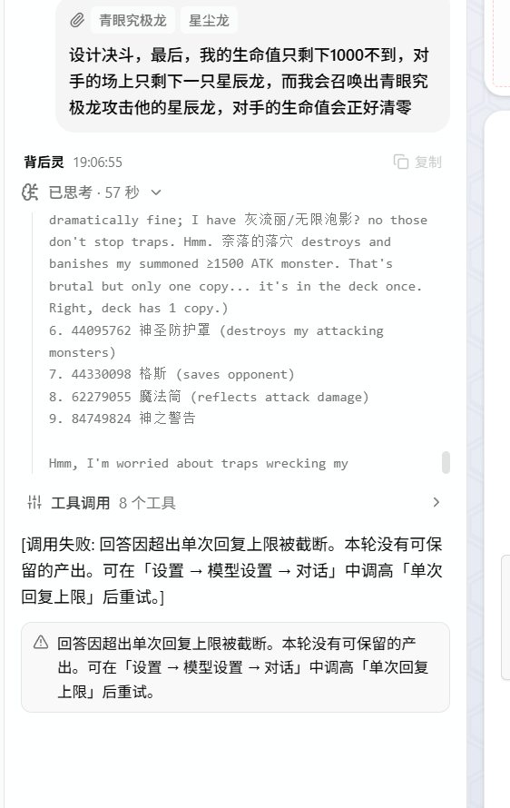

## 回答被单次回复上限截断

`deepseek-flash` 的 `maxTokens` 和 `contextWindow` 都是空的，所以按代码回落到 `maxTokens: 8192`。而当前用的是 `openai-responses` 格式。

`8192` 对编排任务（思考链 + 正文 + 大工具参数）就是紧的。但更关键的是——看日志 `streamChars=0`，正文一个字都没输出，8 次工具调用全是 `get_card_info`（每次返回 12 张卡的完整效果，非常占位置）。这是**模型把预算全烧在查卡上、还没开始写正文就撞上了上限**

### 缺省输出上限不再写死

**agentService.ts**

原来写的是 `...(cfg.maxTokens ? ... : { maxTokens: 8192 })`，理由注释是「deepseek-chat 硬上限就是 8192」。但这等于**把所有模型都当成 deepseek-chat**

`pi=16384 / opencode=32000 / ZCode=32000 / dsh=256000`，而且**四家都主张「缺省值不是全局上限，模型声明了更大的就该原样用」**（ZCode `model-token-limits.ts` 注释写得最明确）

***

现改为 `DEFAULT_MAX_OUTPUT_TOKENS = 32768` + 一个解析函数：用户/模型显式配置的值优先，没配才用缺省，最后再按 `contextWindow - 4096` 钳一次（抄 pi 的 `clampMaxTokensToContext`）

> contextWindow - 4096这个减法是抄 pi 的 `clampMaxTokensToContext`（`pi/packages/ai/src/api/simple-options.ts:18-22`），它里面有个常量 `CONTEXT_SAFETY_TOKENS = 4096
>
> pi agent中：**clamp = min(声明的上限, 窗口剩余 - 4096)**
>
> 
>
> 模型的上下文窗口是「输入 + 输出」**共享**的硬上限。假设窗口 131072：
>
> - 当前对话历史（系统提示 + 你的剧本 + 8 次查卡结果 + 思考）已经占了比如 120000 token
> - 剩给输出的只有 11072 token
> - 如果这时还设置「输出上限 32768」，模型会以为可以写 32768，一写就超出窗口 → 请求直接失败（不是截断，是报错
>
> 
>
> 减 4096 是**留一点缓冲**：让输出预算永远不超过窗口剩余量：
>
> 在例子里（已占 120000，窗口 131072）：
>
> - 窗口剩余 = 131072 − 120000 = **11072**
> - clamp 算出来 = min(32768, 11072 − 4096) = **697**
>
> 
>
> **之所以是 4096 而不是精确计算，因为 token 估算本身有误差（pi/dsh 都用「4 字符 ≈ 1 token」粗估），留余量比算太紧安全**

不过这里还有个更实际的问题：**光靠 clamp 治不了你遇到的截断**。截断的成因是"输出池子里面被工具调用参数挤满"，clamp 只能保证不崩、**不能变出空间**。真正管用的是另外两个机制——**预算告警 + 分回合**。

***

各项目的做法：

| 项目         | 做法                                                         | 关键位置                                                     |
| :----------- | :----------------------------------------------------------- | :----------------------------------------------------------- |
| **pi**       | 有**紧凑的厂商分流**：Anthropic/Bedrock 直接用内置能力表的 `model.maxTokens`；OpenAI Responses 在 `compat.supportsMaxOutputTokens` 为 true 时才发字段，否则**整个省略**让服务端用默认 | `ai/src/api/anthropic-messages.ts:1162`、`openai-responses.ts:340` |
| **opencode** | **强制 32K 封顶**：`OUTPUT_TOKEN_MAX = 32_000`，取 `min(模型声明, 32000)`，模型没声明就用 32K | `provider/transform.ts:18,1481`                              |
| **ZCode**    | **声明值优先 + 剩余窗口钳制**：未声明才用 32K 缺省，然后再按 `contextWindow - 已用 - 1000` 钳 | `runtime/methods/model-token-limits.ts:5-41`                 |
| **dsh**      | **激进默认 256K**，但注释明确「模型自身的上限和请求显式值优先」 | `llm/llm-deepseek/src/defaults.ts:6-8`、`config.ts:25`       |

**共同点**：**没有一家是"硬编码一个数字给所有模型用"**。要么走内置能力表，要么"声明优先 + 缺省兜底"，要么"声明值再钳一次"。

**关键差异**：它们都有**模型能力元数据**（内置的模型表，知道"这个模型支持多少"）。我这个项目**没有**这份元数据——所以只能靠"用户填"或"用缺省"

### `get_card_info` 加「本轮累计预算」

旧的「单次最多 12 张」只防「一次查爆」——注释里甚至记着真实事故（「16+22+11 张连查后预算见底被截断」），但它挡不住「连续 8 次磨光」

新增按字符计的本轮累计闸（16000 字符 ≈ 25~30 张卡），超限后**只回一句引导文案、不再吐效果文**，逼模型用已有信息推进。阈值参考 dsh 的 `thresholdChars: 8192 / headChars: 4096`；拦截思路参考 opencode 的 `DOOM_LOOP_THRESHOLD`

### 截断诊断分清两种成因

新增 `starvedByTools`（正文 0 字 + 有工具调用）与 `cardInfoChars` 字段，错误提示也分开给建议——这种情况的正确答案不是「调高上限」，而是「换一轮再写」。判断依据抄的是 ZCode 的 `classifyOutputTokenContinuation`：**`toolCallCount > 0` 就不该期待正文**

***

**不期待正文：**

原因是那**同一个输出池**：工具调用的参数（比如 `codes: [89631139, ...]`）本身就占编辑输出 token，模型写完工具调用，池子往往已经见底，自然写不出正文。ZCode 的判定逻辑（`turn-output-token-continuation.ts:33`）就是：**如果 `toolCallCount > 0`，就不走"续写"这条路**——因为续写是为了补一段被砍断的文本，而工具轮根本不该有正文。

所以正确姿势是：**工具轮只管调工具，下一轮再写正文**

### **system prompt 补两条约束**：查卡要克制；**工具轮与正文轮分开推进**，别在同一轮里「查完再写完」

另外把设置界面的 `placeholder` 从 8192 改成 32768，并补了说明（留空默认 32768、编排任务建议不低于 16384、deepseek-chat 硬上限 8192）

"超限就不给效果文"的设计，本质上是**用信息缺失来换 token 空间**，方向就错了

为了能让 AI 更好的编排对局，必须要获得所有的效果文本

**①** **真正的矛盾不是"要不要给效果文"，而是"全量效果文不能常驻上下文"**

你有 45 + 42 张卡 ≈ 87 张，每张效果文 400~600 字符 ≈ 全量约 50000 字符 ≈ **12500 token**。这个量级**其实不大**！12500 token 对 131072 的窗口只占 10%。问题出在别处：

- 现在的 `get_card_info` 是**每次调用都重新塞一遍全文**，8 次调用 = 同样的内容被反复塞（如果查的是同一批卡）
- 而**模型的思考过程**（reasoning）才是最耗输出 token 的，不是卡片文

**② 所以正确的解法不是 RAG，而是"一次性全量 + 常驻缓存"。**

RAG（向量检索）是为了解决"知识库太大，几百万条检索不过来"的场景。你这个只有 87 张卡、且**开局就确定**，完全没必要做检索——开局时**一次性把双方牌堆的全部卡牌信息整理成一份紧凑清单**（卡名 + 卡密 + 攻防 + 效果全文），放进会话，之后**再也不重复查**。

这才是真正的解法：

- **开局一次拿全量**（87 张卡的完整信息，约 12500 token，一次性成本）
- **之后不再调用 `get_card_info`**（内容已经在上下文里了）
- 输出预算自然腾出来给思考和编排

**③ 效果文的呈现方式可以压缩。**

效果文里有一堆格式噪音（换行、`①②③`、`●`、条件嵌套）。可以只保留**主干语义**（"通常召唤时，可以从卡组特召 1 只青眼白龙"），去掉装饰性的排版字符。这能再省 30~50%，而且**信息不丢**