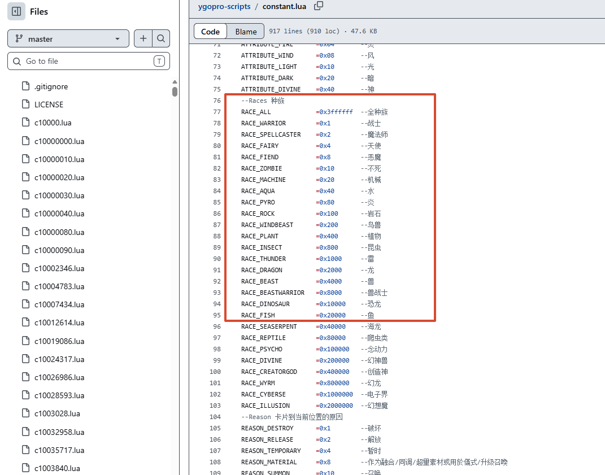
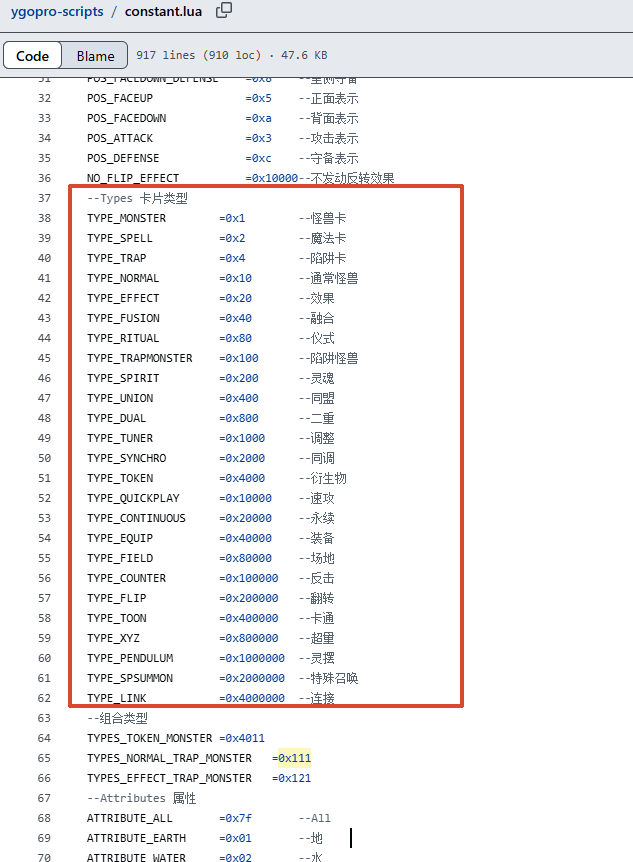
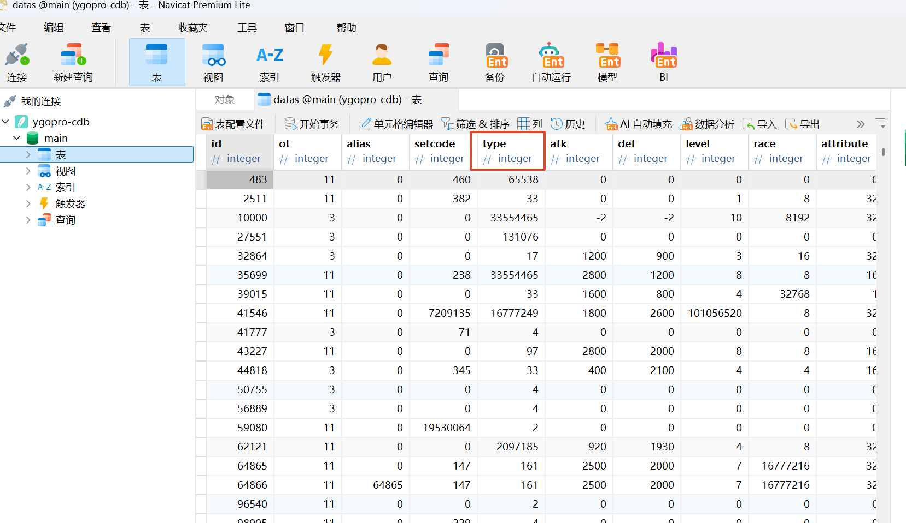

# 游戏王决斗编辑器：多维度高级筛选侧栏与三栏布局重构

本改动属于一个原子化提交，旨在彻底解决原有药丸式搜索筛选维度单一的问题，重塑三栏工作台布局，并引入内部弹性展开的专业级全维度卡片筛选侧栏。

---

## 一、 改动缘由与核心设计目标

1. **废除简陋的药丸式筛选**：原有的「怪兽/魔法/陷阱/额外」四个大类过于粗糙，无法满足游戏王决斗编排与残局制作时对“特定属性、种族、星级、攻防数值及细分类型（如融合/同调/超量/速攻/永续）”的精细检索需求。
2. **引入内部弹性并列高级筛选侧栏**：对标经典 YGOPro 工具风格，在卡片搜索列表右侧新增可折叠/展开的筛选栏（`FilterDrawer`）。采用**方案 A（内部弹性并列栏）**：展开时在窗口内平滑占用中间场地在大屏/最大化时的多余居中留白，绝对不拉伸操作系统窗口本身，最大化下依然游刃有余。
3. **工作台三栏布局重排**：将界面调整为更符合人机工程学直觉的 **「左侧：卡片大图与效果详情」+「中央：极简纯粹决斗台」+「右侧：卡片检索与高级筛选」**，形成“右侧找卡拖拽入场，左侧实时查阅卡片效果”的流畅工作流。
4. **提升列表信息密度与结果计数**：检索列表实时统计并显示匹配卡片总数（如 `搜索结果: 87 张`），卡片列表项直接展示卡图、卡名、属性/种族/星级（如 `光/龙 ☆8`）及攻防数值，无需反复悬停即可掌握卡片基础属性。

---

## 二、 各模块代码改动明细与 Diff

### 1. **src/shared/types/card.ts**

- **改动缘由**：补充完整的 25 种官方种族标志位枚举（`CardRace`）与中文名称映射字典（`RACE_NAMES`），并新增卡片细分类型标签提取方法（`getCardTypeLabel`），为前端高级筛选下拉框与卡片列表项的紧凑排版提供统一的数据字典。

```diff
+/**
+ * 种族标志位
+ */
+export const CardRace = {
+  WARRIOR: 0x1,
+  SPELLCASTER: 0x2,
+  FAIRY: 0x4,
+  FIEND: 0x8,
+  ZOMBIE: 0x10,
+  MACHINE: 0x20,
+  AQUA: 0x40,
+  PYRO: 0x80,
+  ROCK: 0x100,
+  WINGED_BEAST: 0x200,
+  PLANT: 0x400,
+  INSECT: 0x800,
+  THUNDER: 0x1000,
+  DRAGON: 0x2000,
+  BEAST: 0x4000,
+  BEAST_WARRIOR: 0x8000,
+  DINOSAUR: 0x10000,
+  FISH: 0x20000,
+  SEA_SERPENT: 0x40000,
+  REPTILE: 0x80000,
+  PSYCHIC: 0x100000,
+  DIVINE_BEAST: 0x200000,
+  CREATOR_GOD: 0x400000,
+  WYRM: 0x800000,
+  CYBERSE: 0x1000000,
+  ILLUSION: 0x2000000
+} as const
+
+export const RACE_NAMES: Record<number, string> = {
+  [CardRace.WARRIOR]: '战士',
+  [CardRace.SPELLCASTER]: '魔法师',
+  [CardRace.FAIRY]: '天使',
+  [CardRace.FIEND]: '恶魔',
+  [CardRace.ZOMBIE]: '不死',
+  [CardRace.MACHINE]: '机械',
+  [CardRace.AQUA]: '水',
+  [CardRace.PYRO]: '炎',
+  [CardRace.ROCK]: '岩石',
+  [CardRace.WINGED_BEAST]: '鸟兽',
+  [CardRace.PLANT]: '植物',
+  [CardRace.INSECT]: '昆虫',
+  [CardRace.THUNDER]: '雷',
+  [CardRace.DRAGON]: '龙',
+  [CardRace.BEAST]: '兽',
+  [CardRace.BEAST_WARRIOR]: '兽战士',
+  [CardRace.DINOSAUR]: '恐龙',
+  [CardRace.FISH]: '鱼',
+  [CardRace.SEA_SERPENT]: '海龙',
+  [CardRace.REPTILE]: '爬虫类',
+  [CardRace.PSYCHIC]: '念动力',
+  [CardRace.DIVINE_BEAST]: '幻神兽',
+  [CardRace.CREATOR_GOD]: '创造神',
+  [CardRace.WYRM]: '幻龙',
+  [CardRace.CYBERSE]: '电子界',
+  [CardRace.ILLUSION]: '幻想魔'
+}

// ...


+  // 获取卡片简明分类标签
+  getCardTypeLabel: (type: number): string => {
+    if (CardUtils.isMonster(type)) {
+      if (type & CardType.LINK) return '连接'
+      if (type & CardType.XYZ) return '超量'
+      if (type & CardType.SYNCHRO) return '同调'
+      if (type & CardType.FUSION) return '融合'
+      if (type & CardType.RITUAL) return '仪式'
+      if (type & CardType.PENDULUM) return '灵摆'
+      if (type & CardType.EFFECT) return '效果'
+      if (type & CardType.NORMAL) return '通常'
+      if (type & CardType.TOKEN) return '衍生物'
+      return '怪兽'
+    }
+    if (CardUtils.isSpell(type)) {
+      if (type & CardType.QUICKPLAY) return '速攻'
+      if (type & CardType.CONTINUOUS) return '永续'
+      if (type & CardType.EQUIP) return '装备'
+      if (type & CardType.FIELD) return '场地'
+      if (type & CardType.RITUAL) return '仪式'
+      return '通常魔法'
+    }
+    if (CardUtils.isTrap(type)) {
+      if (type & CardType.COUNTER) return '反击'
+      if (type & CardType.CONTINUOUS) return '永续'
+      return '通常陷阱'
+    }
+    return '未知'
   }
 }
```

#### 种族标志位来源与位掩码说明

##### 十六进制与位掩码机制

`0x` 在计算机中代表十六进制（Hexadecimal）。标志位取值为 `0x1, 0x2, 0x4, 0x8, 0x10, 0x20...`，是因为它们本质上是**二进制位掩码（Bitmask）**，每一位代表一个独立的属性开关：

| 十六进制 (`0x`) | 十进制 | 二进制（每位对应独立开关） | 代表种族 |
| :-------------- | :----- | :------------------------- | :------- |
| `0x1`           | 1      | `0000 0000 0000 0001`      | 战士族   |
| `0x2`           | 2      | `0000 0000 0000 0010`      | 魔法师族 |
| `0x4`           | 4      | `0000 0000 0000 0100`      | 天使族   |
| `0x8`           | 8      | `0000 0000 0000 1000`      | 恶魔族   |
| `0x10`          | 16     | `0000 0000 0001 0000`      | 不死族   |
| `0x20`          | 32     | `0000 0000 0010 0000`      | 机械族   |
| `...`           | ...    | ...                        | ...      |

在游戏王核心数据库 `cards.cdb` 中，`datas` 数据表仅使用单一整数列 `race` 存储卡片的种族数据。采用位掩码机制的设计原因：

- 支持复合种族表达：若单卡具备多个种族特性，通过按位或运算（如 `0x1 | 0x2 = 0x3`）即可在单一字段内同时记录。
- 高性能检索：SQLite 检索时通过按位与运算 `WHERE (datas.race & ?) > 0` 即可在毫秒级时间内完成精确匹配。

##### 官方标准与权威参考来源

这些常数值属于游戏王规则模拟核心引擎 `ocgcore` 以及全生态各类 YGOPro 客户端统一遵守的行业黄金标准规范：

**YGOPro 创始人 Fluorohydride（圆神）官方脚本仓库**

[仓库地址](https://github.com/Fluorohydride/ygopro-scripts/blob/master/constant.lua)

> 因为mycard也是[fork的圆神仓库](https://github.com/mycard/ygopro)，所以可以在本地路径找到，如：MyCardLibrary\ygopro\script\constant.lua



---

### 2. **src/shared/types/ipc.ts**

- **改动缘由**：在 IPC 协议层扩展 `CardSearchParams` 接口，支持子类型 `subType`、描述搜索开关 `searchDesc`、卡密 `code` 与动态排序字段；新增 `CardSearchResult` 类型，携带符合条件的数据列表与总匹配数 `total`。

```diff
 export interface CardSearchParams {
   keyword?: string // 卡名 / 效果描述 / 8位卡密
-  type?: number // 种类掩码
+  searchDesc?: boolean // 是否在效果描述中检索关键词 (默认 true)
+  type?: number // 主种类掩码 (Monster / Spell / Trap)
+  subType?: number // 细分种类掩码 (Fusion / Synchro / Quickplay 等)
   race?: number // 种族掩码
   attribute?: number // 属性掩码
   level?: number // 星级 / Rank / Link
   atk?: number // 攻击力
   def?: number // 守备力
+  code?: number // 8位卡密精准匹配
+  sortField?: 'id' | 'atk' | 'def' | 'level' | 'name' // 排序字段
+  sortOrder?: 'ASC' | 'DESC' // 排序方向
   limit?: number // 每次返回条数 (默认 50)
   offset?: number // 分页偏移量
 }

+/**
+ * 卡片检索返回结果
+ */
+export interface CardSearchResult {
+  cards: CdbCard[]
+  total: number
+}
+
 /**
  * 用户配置
  */
   // CDB 数据库操作
   selectCdbFile: () => Promise<string | null>
   loadCdb: (path: string) => Promise<boolean>
-  searchCards: (params: CardSearchParams) => Promise<CdbCard[]>
+  searchCards: (params: CardSearchParams) => Promise<CardSearchResult>
   getCardsByIds: (ids: number[]) => Promise<Record<number, CdbCard>>
```

#### 种类与细分类型掩码的来源与拆分说明

##### constant.lua 中的种类标志位定义

在官方对局引擎与常数库中，主种类（`type`）与细分类型（`subType`）的掩码**全部位于 `constant.lua`**：

- 对应常数定义列表：



##### 为什么在 IPC 参数中拆分 type 与 subType

- **底层数据库真实结构**
  在游戏王核心数据库 `cards.cdb` 的 `datas` 表中，实际上仅有单一整数字段 `datas.type`。一张卡片的完整种类是通过按位或（Bitwise OR）组合存储的。

可以自己手动通过数据库连接工具查看cdb文件

> 这里我使用navicat，选择SQLite数据库



**逐卡详细解析**

ID = 483（速攻魔法卡）

- **Type 字段拆解**：
  - 十进制：`65538`
  - 十六进制：`0x10002`
  - 按位分解：
    - `0x10002` = `0x2`（魔法卡）+ `0x10000`（速攻）
- **其他属性**：
  - 因为是魔法卡，所以无攻防与种族属性：`atk = 0`、`def = 0`、`race = 0`。

---

ID = 2511（效果怪兽）

- **Type 字段拆解**：
  - 十进制：`33`
  - 十六进制：`0x21`
  - 按位分解：
    - `33 = 1 + 32`，即 `0x21` = `0x1`（怪兽）+ `0x20`（效果）
- **种族与属性**：
  - `race = 8`：对应十六进制 `0x8`（**恶魔族**）
  - `attribute = 32`：对应十六进制 `0x20`（**暗属性**）

---

ID = 32864（通常怪兽）

- **Type 字段拆解**：
  - 十进制：`17`
  - 十六进制：`0x11`
  - 按位分解：
    - `17 = 1 + 16`，即 `0x11` = `0x1`（怪兽）+ `0x10`（通常）
- **面板数值**：
  - 攻守：`atk = 1200`，`def = 900`
  - 等级：`level = 3`（3 星）
  - 种族：`race = 16`，对应十六进制 `0x10`（**不死族**）

---

ID = 41546（灵摆怪兽 · 复合 Level 编码）

灵摆怪兽的 `level` 字段采用**高低位字节拼接**，将左右刻度与怪兽星级压缩在同一个 32 位整数中：

- **原始字段**：`level = 101056520`
- **转十六进制**：`0x06060008`

字节结构拆解

```text
 0x  06       06       00       08
     │        │        │        └── 怪兽原始星级 (Level: 8)
     │        │        └─────────── 保留位
     │        └──────────────────── 右灵摆刻度 (Right Scale: 6)
     └───────────────────────────── 左灵摆刻度 (Left Scale: 6)
```

代码提取逻辑

```c
// 提取左灵摆刻度 (最高字节)
int left_scale  = (level >> 24) & 0xFF;  // 0x06 -> 6

// 提取右灵摆刻度 (次高字节)
int right_scale = (level >> 16) & 0xFF;  // 0x06 -> 6

// 提取怪兽星级 (最低字节)
int card_level  = level & 0xFF;          // 0x08 -> 8 星
```

- **前端交互体验解耦**
  在高级筛选抽屉中，如果将全部类型混在一起展示会让筛选层级混乱。将其拆分为 `type`（主大类：怪兽/魔法/陷阱）与 `subType`（细分种类：融合/同调/速攻/场地等），可以让用户在选择特定大类时联动展示对应的细分分类选项。
- **后端数据库查询映射**
  在 **src/main/db/cdbService.ts** 处理检索请求时，`type` 与 `subType` 最终都会转化为针对 `datas.type` 列的独立按位与过滤条件：

  ```sql
  -- 例如检索“融合怪兽”
  WHERE (datas.type & 0x1) > 0 AND (datas.type & 0x40) > 0
  ```

---

### 3. **src/main/db/cdbService.ts**

- **改动缘由**：底层 SQLite 检索引擎升级：实现关键词仅搜卡名与兼搜效果文本的动态分支、支持 `(d.level & 255)` 星级位掩码运算、主种类与子种类分离位运算、精准卡密过滤、动态 `ORDER BY`，并通过高效的 `COUNT(*)` 联表统计返回精确的检索命中总数。

```diff
 import Database from 'better-sqlite3'
-import { CdbCard, CardSearchParams } from '@shared/index'
+import { CdbCard, CardSearchParams, CardSearchResult } from '@shared/index'
 import { existsSync } from 'fs'

   /**
-   * 多条件检索卡片
+   * 多条件检索卡片 (支持全文/卡名、种类、细分类型、属性、种族、星级、攻防、卡密、排序)
    */
-  public search(params: CardSearchParams): CdbCard[] {
-    if (!this.db) return []
+  public search(params: CardSearchParams): CardSearchResult {
+    if (!this.db) return { cards: [], total: 0 }

-    let sql = `
-      SELECT
-        d.id, d.ot, d.alias, d.setcode, d.type, d.atk, d.def, d.level, d.race, d.attribute, d.category,
-        t.name, t.desc
-      FROM datas d
-      JOIN texts t ON d.id = t.id
-      WHERE 1=1
-    `
+    let baseWhere = ' FROM datas d JOIN texts t ON d.id = t.id WHERE 1=1'
     const args: (string | number)[] = []

     // 关键词搜索 (卡名、效果描述、或者精确卡密)
     if (params.keyword && params.keyword.trim().length > 0) {
       const kw = params.keyword.trim()
-      // 如果是纯数字，优先匹配卡密
       if (/^\d+$/.test(kw)) {
-        sql += ` AND (d.id = ? OR t.name LIKE ?)`
+        baseWhere += ' AND (d.id = ? OR t.name LIKE ?)'
         args.push(parseInt(kw, 10), `%${kw}%`)
       } else {
-        sql += ` AND (t.name LIKE ? OR t.desc LIKE ?)`
-        args.push(`%${kw}%`, `%${kw}%`)
+        if (params.searchDesc !== false) {
+          baseWhere += ' AND (t.name LIKE ? OR t.desc LIKE ?)'
+          args.push(`%${kw}%`, `%${kw}%`)
+        } else {
+          baseWhere += ' AND t.name LIKE ?'
+          args.push(`%${kw}%`)
+        }
       }
     }

-    // 种类过滤 (使用位与运算)
+    // 精确卡密过滤
+    if (params.code !== undefined && params.code > 0) {
+      baseWhere += ' AND d.id = ?'
+      args.push(params.code)
+    }
+
+    // 主种类过滤 (Monster / Spell / Trap)
     if (params.type !== undefined && params.type !== 0) {
-      sql += ` AND (d.type & ?) = ?`
-      args.push(params.type, params.type)
+      baseWhere += ' AND (d.type & ?) != 0'
+      args.push(params.type)
+    }
+
     // 细分种类过滤 (如 Fusion / Synchro / Quickplay / Continuous 等)
     if (params.subType !== undefined && params.subType !== 0) {
-      sql += ` AND (d.type & ?) != 0`
+      baseWhere += ' AND (d.type & ?) != 0'
       args.push(params.subType)
     }

     // 属性过滤
     if (params.attribute !== undefined && params.attribute !== 0) {
-      sql += ` AND (d.attribute & ?) != 0`
+      baseWhere += ' AND (d.attribute & ?) != 0'
       args.push(params.attribute)
     }

     // 种族过滤
     if (params.race !== undefined && params.race !== 0) {
-      sql += ` AND (d.race & ?) != 0`
+      baseWhere += ' AND (d.race & ?) != 0'
       args.push(params.race)
     }

+    // 等级/阶级/连接值过滤 (取低 8 位: d.level & 0xff)
+    if (params.level !== undefined && params.level > 0) {
+      baseWhere += ' AND (d.level & 255) = ?'
+      args.push(params.level)
+    }
+
     // 攻击力过滤
     if (params.atk !== undefined && params.atk >= 0) {
-      sql += ` AND d.atk = ?`
+      baseWhere += ' AND d.atk = ?'
       args.push(params.atk)
     }

     // 守备力过滤
     if (params.def !== undefined && params.def >= 0) {
-      sql += ` AND d.def = ?`
+      baseWhere += ' AND d.def = ?'
       args.push(params.def)
     }

     try {
-      // 1. 获取符合条件的总数
-      const countSql = `SELECT count(*) as total` + baseWhere
-      const countStmt = this.db.prepare(countSql)
-      const countRow = countStmt.get(...args) as { total: number } | undefined
-      const total = countRow?.total ?? 0
-
-      // 2. 排序规则
-      let orderBy = 'd.id'
-      if (params.sortField === 'atk') orderBy = 'd.atk'
-      else if (params.sortField === 'def') orderBy = 'd.def'
-      else if (params.sortField === 'level') orderBy = '(d.level & 255)'
-      else if (params.sortField === 'name') orderBy = 't.name'
-
-      const orderDir = params.sortOrder === 'ASC' ? 'ASC' : 'DESC'
-
-      // 3. 分页查询记录
-      const dataSql = `
-        SELECT
-          d.id, d.ot, d.alias, d.setcode, d.type, d.atk, d.def, d.level, d.race, d.attribute, d.category,
-          t.name, t.desc
-        ${baseWhere}
-        ORDER BY ${orderBy} ${orderDir} LIMIT ? OFFSET ?
-      `
-      const dataStmt = this.db.prepare(dataSql)
-      const rows = dataStmt.all(...args, params.limit || 50, params.offset || 0) as CdbCard[]
-
-      return { cards: rows, total }
     } catch (err) {
       console.error('[CdbService] Search error:', err)
-      return []
+      return { cards: [], total: 0 }
     }
   }
```

#### 数据库检索引擎实现原理说明

##### 基础查询结构与参数化预编译机制

在构建动态检索 SQL 时，采用了经典的 `WHERE 1=1` 与参数化占位符：

- **基础结构拼接（WHERE 1=1）**：
  通过 `FROM datas d JOIN texts t ON d.id = t.id WHERE 1=1` 作为查询起点。`1=1` 恒为真，便于后续各个可选筛选条件统一通过 `AND ...` 无缝追加，避免复杂的首条件判断逻辑。
- **参数化预编译（防止 SQL 注入）**：
  SQL 语句中所有动态变量一律使用 `?` 占位符，并通过 `args.push(...)` 收集对应参数，最终交由 SQLite 原生引擎编译执行（如 `this.db.prepare(sql).all(...args)`）。彻底防止单引号截断或 SQL 注入风险，并享受底层执行计划缓存带来的性能提升。

##### 关键词检索与效果描述搜索开关

- **卡密与数字识别**：
  使用正则 `/^\d+$/.test(kw)` 识别纯数字输入，通过 `AND (d.id = ? OR t.name LIKE ?)` 同时支持按 8 位数字卡密精准匹配与按卡名包含数字模糊匹配。
- **效果文本检索开关（searchDesc !== false）**：
  - 当用户开启（或默认未显式关闭）时，执行 `AND (t.name LIKE ? OR t.desc LIKE ?)`，卡名或效果说明中包含关键词均会命中。
  - 当用户在高级筛选抽屉中显式关闭时，仅执行 `AND t.name LIKE ?`，杜绝效果文本中含有相关字段但卡名不符的卡片干扰，保证结果纯净度。

##### 种类、种族与属性的按位与过滤

针对 `d.type`、`d.race`、`d.attribute` 字段，均利用 SQLite 原生位运算符 `&` 进行过滤（例如 `AND (d.type & ?) != 0`）：

- 只要卡片的对应字段与传入的标志位进行按位与计算的结果不为 0，即代表点亮了该属性标志，判定为匹配。
- 完美兼容青眼究极龙（融合怪兽 `0x1 | 0x40`）、旋风（速攻魔法 `0x2 | 0x10000`）等复合掩码卡片。

##### 等级/阶级与灵摆刻度掩蔽（& 255）

在过滤等级时，SQL 明确采用 `AND (d.level & 255) = ?` 而非裸写 `d.level = ?`：

- **数据结构原因**：
  在 `cards.cdb` 中，灵摆怪兽的 `level` 字段采用 32 位整型同时存储三个数值：最高 8 位为左刻度、次高 8 位为右刻度、最低 8 位为怪兽原始星级（例如某 8 星双刻度 6 的怪兽存储为 `101056520`，十六进制为 `0x06060008`）。
- **掩码剥离效果**：
  `255` 对应十六进制 `0xFF`（二进制低 8 位 `1111 1111`）。执行 `d.level & 255` 能精准屏蔽高位的左右灵摆刻度，仅提取出纯粹的怪兽星级 / 阶级 / Link 值，确保灵摆怪兽能与常规怪兽一同被正确检索。

---

### 4. **src/renderer/src/stores/useCardSearchStore.ts**

- **改动缘由**：重写 Zustand 状态仓库：将原先单一的 `typeFilter` 扩展为包含多维度筛选字段的 `CardSearchFilters`，新增侧栏展开折叠状态 `isFilterOpen`、重置动作 `resetFilters` 与结果总数 `total` 追踪，实现筛选器修改即自动触发防抖检索。

```diff
-interface CardSearchStoreState {
+export interface CardSearchFilters {
   keyword: string
-  typeFilter: number
+  searchDesc: boolean
+  type: number // 0: 全部, 或 CardType.MONSTER / SPELL / TRAP
+  subType: number // 细分种类
+  attribute: number // 属性掩码
+  race: number // 种族掩码
+  level: number // 等级 / Rank / Link
+  atk: number | undefined // 攻击力
+  def: number | undefined // 守备力
+  code: number | undefined // 精确卡密
+  sortField: 'id' | 'atk' | 'def' | 'level' | 'name'
+  sortOrder: 'ASC' | 'DESC'
+}
+
+export const DEFAULT_FILTERS: CardSearchFilters = {
+  keyword: '',
+  searchDesc: true,
+  type: 0,
+  subType: 0,
+  attribute: 0,
+  race: 0,
+  level: 0,
+  atk: undefined,
+  def: undefined,
+  code: undefined,
+  sortField: 'id',
+  sortOrder: 'DESC'
+}
+
+export interface CardSearchStoreState extends CardSearchFilters {
   results: CdbCard[]
+  total: number
   isLoading: boolean
   isLoadingMore: boolean
   hasMore: boolean
   hasSearched: boolean
+  /** 高级筛选抽屉是否展开 */
+  isFilterOpen: boolean
+
+  /** 设置高级筛选抽屉的展开/收起状态 */
+  setIsFilterOpen: (open: boolean) => void
+  /** 切换高级筛选抽屉的展开/收起状态 */
+  toggleFilterOpen: () => void
   setKeyword: (keyword: string) => void
-  setTypeFilter: (type: number) => void
+  /** 批量更新多维筛选条件（种类、属性、种族、星级等）并触发自动检索 */
+  setFilters: (partial: Partial<CardSearchFilters>) => void
+  /** 重置所有多维筛选条件为默认初始值 */
+  resetFilters: () => void
   search: (customParams?: Partial<CardSearchParams>) => Promise<void>
   loadMore: () => Promise<void>
   clear: () => void
 }

 export const useCardSearchStore = create<CardSearchStoreState>((set, get) => ({
-  keyword: '',
-  typeFilter: 0,
+  ...DEFAULT_FILTERS,
   results: [],
+  total: 0,
   isLoading: false,
   isLoadingMore: false,
   hasMore: true,
   hasSearched: false,
+  isFilterOpen: false,
+
+  setIsFilterOpen: (isFilterOpen) => set({ isFilterOpen }),
+  toggleFilterOpen: () => set((state) => ({ isFilterOpen: !state.isFilterOpen })),

   setKeyword: (keyword) => set({ keyword }),
-  setTypeFilter: (typeFilter) => {
-    set({ typeFilter })
+
+  setFilters: (partial) => {
+    set((state) => ({ ...state, ...partial }))
+    get().search()
+  },
+
+  resetFilters: () => {
+    set({
+      ...DEFAULT_FILTERS,
+      keyword: get().keyword // 保留搜索框已输入的关键字
+    })
     get().search()
   },

   search: async (customParams = {}) => {
-    const currentKeyword = customParams.keyword !== undefined ? customParams.keyword : get().keyword
-    const currentType = customParams.type !== undefined ? customParams.type : get().typeFilter
+    const state = get()
+    const mergedParams: CardSearchParams = {
+      keyword: customParams.keyword !== undefined ? customParams.keyword : state.keyword,
+      searchDesc:
+        customParams.searchDesc !== undefined ? customParams.searchDesc : state.searchDesc,
+      type: customParams.type !== undefined ? customParams.type : state.type,
+      subType: customParams.subType !== undefined ? customParams.subType : state.subType,
+      attribute: customParams.attribute !== undefined ? customParams.attribute : state.attribute,
+      race: customParams.race !== undefined ? customParams.race : state.race,
+      level: customParams.level !== undefined ? customParams.level : state.level,
+      atk: customParams.atk !== undefined ? customParams.atk : state.atk,
+      def: customParams.def !== undefined ? customParams.def : state.def,
+      code: customParams.code !== undefined ? customParams.code : state.code,
+      sortField: customParams.sortField !== undefined ? customParams.sortField : state.sortField,
+      sortOrder: customParams.sortOrder !== undefined ? customParams.sortOrder : state.sortOrder,
+      limit: customParams.limit || PAGE_SIZE,
+      offset: 0,
+      ...customParams
+    }
+
     set({
-      keyword: currentKeyword,
-      typeFilter: currentType,
       isLoading: true,
       hasMore: true
     })
+
     try {
-      const params: CardSearchParams = {
-        keyword: currentKeyword,
-        type: currentType,
-        limit: customParams.limit || PAGE_SIZE,
-        offset: 0,
-        ...customParams
-      }
-      const cards = await window.api.searchCards(params)
+      const res = await window.api.searchCards(mergedParams)
       set({
-        results: cards,
+        results: res.cards,
+        total: res.total,
         isLoading: false,
         hasSearched: true,
-        hasMore: cards.length >= (params.limit || PAGE_SIZE)
+        hasMore: res.cards.length >= (mergedParams.limit || PAGE_SIZE)
       })
     } catch (err) {
       console.error('[useCardSearchStore] search failed:', err)
-      set({ results: [], isLoading: false, hasSearched: true, hasMore: false })
+      set({ results: [], total: 0, isLoading: false, hasSearched: true, hasMore: false })
     }
   },

   loadMore: async () => {
-    const { keyword, typeFilter, results, isLoading, isLoadingMore, hasMore } = get()
-    if (isLoading || isLoadingMore || !hasMore) return
+    const state = get()
+    if (state.isLoading || state.isLoadingMore || !state.hasMore) return

     set({ isLoadingMore: true })
     try {
       const params: CardSearchParams = {
-        keyword,
-        type: typeFilter,
+        keyword: state.keyword,
        searchDesc: state.searchDesc,
        type: state.type,
        subType: state.subType,
        attribute: state.attribute,
        race: state.race,
        level: state.level,
        atk: state.atk,
        def: state.def,
        code: state.code,
        sortField: state.sortField,
        sortOrder: state.sortOrder,
        limit: PAGE_SIZE,
        offset: state.results.length
      }

      const res = await window.api.searchCards(params)
      if (res.cards.length === 0) {
        set({ isLoadingMore: false, hasMore: false })
        return
      }

      const existingIds = new Set(state.results.map((c) => c.id))
      const uniqueNewCards = res.cards.filter((c) => !existingIds.has(c.id))

      set({
        results: [...state.results, ...uniqueNewCards],
        total: res.total,
        isLoadingMore: false,
        hasMore: res.cards.length >= PAGE_SIZE
      })
    } catch (err) {
      console.error('[useCardSearchStore] loadMore failed:', err)
    }
  },

  clear: () =>
    set({
      ...DEFAULT_FILTERS,
      results: [],
      total: 0,
      hasSearched: false,
      hasMore: true
    })
}))
```

#### 搜索状态管理与分页控制机制说明

##### TypeScript 类型契约与状态划分

在 **src/renderer/src/stores/useCardSearchStore.ts** 中，通过接口将状态拆解为清晰的职责层级：

- **CardSearchFilters**：定义所有筛选条件的键值与类型（包含关键词、主种类、细分类型、种族、属性、星级、攻防、卡密与排序），保证所有组件在修改筛选参数时的类型安全。
- **CardSearchStoreState**：继承筛选条件接口，并组合了运行时状态（`results` 列表、`total` 命中数、`isLoading` 加载标志、`isFilterOpen` 展开标志）与所有 Action 函数签名，供组件调用时享有完整的 IDE 代码补全与类型检查。

##### 抽屉开关的双接口设计（toggleFilterOpen 与 setIsFilterOpen）

针对高级筛选抽屉的开闭状态，Store 同时提供了两个操作方法：

- **toggleFilterOpen（取反切换）**：
  专为界面上的切换按钮设计（如搜索栏右侧的橙色漏斗按钮与抽屉内部的收起箭头）。调用方无需先读取当前状态再做取反判断，直接绑定点击事件即可实现“展开/收起”的循环切换。
- **setIsFilterOpen（显式赋值）**：
  接受明确的布尔值参数，服务于特定外部事件驱动的控制场景（例如监听键盘 `Escape` 键强制收起侧栏、小屏幕响应式布局下的自动折叠、或从外部特定卡片快捷入口强制展开筛选栏）。

##### 分页加载与见底判断逻辑（hasMore）

在 `search` 与 `loadMore` 中，采用了一套经典的分页状态推导：

```ts
hasMore: res.cards.length >= (mergedParams.limit || PAGE_SIZE)
```

- **满载推导（>= 40）**：
  若本次从 SQLite 数据库查出的卡片数量达到了单页请求配额（默认 `PAGE_SIZE = 40`），表明数据库后方大概率仍存在后续卡片，因此置 `hasMore = true`，允许用户滚动到底部时继续触发 `loadMore()` 追加数据。
- **见底推导（< 40）**：
  若返回的卡片数少于 40 条（例如筛选冷门条件全库仅有 5 条），说明数据库已经全部检索完毕，因此直接将 `hasMore` 标记为 `false`，彻底避免用户继续下滑时触发无意义的空查询。

---

### 5. **src/renderer/src/components/CardSearch/FilterDrawer.tsx** (全新创建组件)

- **改动缘由**：新建右侧高级筛选并列抽屉组件，集成主类别选择、子类别动态联动、属性/种族/星级下拉选单、攻防与卡密输入框、排序方式切换、卡片效果文检索复选开关以及一键重置功能。

```diff
+import React from 'react'
+import {
+  SlidersHorizontal,
+  RotateCcw,
+  ChevronRight,
+  ArrowDownUp,
+  CheckSquare,
+  Square
+} from 'lucide-react'
+import { CardType, CardAttribute, ATTRIBUTE_NAMES, CardRace, RACE_NAMES } from '@shared/index'
+import { useCardSearchStore } from '../../stores/useCardSearchStore'
+import { Button } from '../ui/button'
+import { Input } from '../ui/input'
+import { Select, SelectContent, SelectItem, SelectTrigger, SelectValue } from '../ui/select'
+import { Separator } from '../ui/separator'
+
+// 主类别选项
+const MAIN_TYPES = [
+  { label: '全部种类', value: 0 },
+  { label: '怪兽卡', value: CardType.MONSTER },
+  { label: '魔法卡', value: CardType.SPELL },
+  { label: '陷阱卡', value: CardType.TRAP }
+]
+
+// 怪兽细分种类选项
+const MONSTER_SUB_TYPES = [
+  { label: '全部子类', value: 0 },
+  { label: '通常', value: CardType.NORMAL },
+  { label: '效果', value: CardType.EFFECT },
+  { label: '融合', value: CardType.FUSION },
+  { label: '仪式', value: CardType.RITUAL },
+  { label: '同调', value: CardType.SYNCHRO },
+  { label: '超量', value: CardType.XYZ },
+  { label: '灵摆', value: CardType.PENDULUM },
+  { label: '连接', value: CardType.LINK },
+  { label: '调整', value: CardType.TUNER },
+  { label: '翻转', value: CardType.FLIP },
+  { label: '衍生物', value: CardType.TOKEN }
+]
+
+// 魔法细分种类选项
+const SPELL_SUB_TYPES = [
+  { label: '全部魔法', value: 0 },
+  { label: '通常魔法', value: CardType.NORMAL },
+  { label: '速攻魔法', value: CardType.QUICKPLAY },
+  { label: '永续魔法', value: CardType.CONTINUOUS },
+  { label: '装备魔法', value: CardType.EQUIP },
+  { label: '场地魔法', value: CardType.FIELD },
+  { label: '仪式魔法', value: CardType.RITUAL }
+]
+
+// 陷阱细分种类选项
+const TRAP_SUB_TYPES = [
+  { label: '全部陷阱', value: 0 },
+  { label: '通常陷阱', value: CardType.NORMAL },
+  { label: '永续陷阱', value: CardType.CONTINUOUS },
+  { label: '反击陷阱', value: CardType.COUNTER }
+]
+
+export const FilterDrawer: React.FC = () => {
+  const {
+    type,
+    subType,
+    attribute,
+    race,
+    level,
+    atk,
+    def,
+    code,
+    searchDesc,
+    sortField,
+    sortOrder,
+    setFilters,
+    resetFilters,
+    toggleFilterOpen
+  } = useCardSearchStore()
+
+  // 根据当前主种类动态获得子种类列表
+  const currentSubTypes = React.useMemo(() => {
+    if (type === CardType.SPELL) return SPELL_SUB_TYPES
+    if (type === CardType.TRAP) return TRAP_SUB_TYPES
+    return MONSTER_SUB_TYPES
+  }, [type])
+
+  return (
+    <div className="w-68 h-full flex flex-col bg-card/75 border-l border-border/60 shrink-0 select-none overflow-hidden animate-in slide-in-from-right-2 duration-200">
+      {/* 顶部标题与折叠栏 */}
+      <div className="h-11 px-3 border-b border-border/50 flex items-center justify-between bg-muted/20 shrink-0">
+        <div className="flex items-center gap-1.5 font-semibold text-xs text-foreground">
+          <SlidersHorizontal className="w-3.5 h-3.5 text-amber-400" />
+          <span>高级筛选条件</span>
+        </div>
+        <div className="flex items-center gap-1">
+          <Button
+            variant="ghost"
+            size="xs"
+            onClick={resetFilters}
+            className="h-6 text-[11px] text-muted-foreground hover:text-foreground gap-1 px-1.5"
+            title="重置所有筛选条件"
+          >
+            <RotateCcw className="w-3 h-3" />
+            <span>重置</span>
+          </Button>
+          <Button
+            variant="ghost"
+            size="icon-xs"
+            onClick={toggleFilterOpen}
+            className="h-6 w-6 text-muted-foreground hover:text-foreground"
+            title="收起筛选栏"
+          >
+            <ChevronRight className="w-3.5 h-3.5" />
+          </Button>
+        </div>
+      </div>
+
+      {/* 筛选表单区域 */}
+      <div className="flex-1 overflow-y-auto p-3 space-y-3.5 text-xs">
+        {/* 卡片大类 */}
+        <div className="space-y-1.5">
+          <label className="text-[11px] font-medium text-muted-foreground">卡片大类</label>
+          <Select
+            value={type}
+            onValueChange={(val) => {
+              const num = val ? Number(val) : 0
+              setFilters({ type: num, subType: 0 })
+            }}
+          >
+            <SelectTrigger size="sm" className="h-7 text-xs">
+              <SelectValue />
+            </SelectTrigger>
+            <SelectContent>
+              {MAIN_TYPES.map((t) => (
+                <SelectItem key={t.value} value={t.value}>
+                  {t.label}
+                </SelectItem>
+              ))}
+            </SelectContent>
+          </Select>
+        </div>
+
+        {/* 细分类型 */}
+        <div className="space-y-1.5">
+          <label className="text-[11px] font-medium text-muted-foreground">细分类型</label>
+          <Select
+            value={subType}
+            onValueChange={(val) => setFilters({ subType: val ? Number(val) : 0 })}
+          >
+            <SelectTrigger size="sm" className="h-7 text-xs">
+              <SelectValue />
+            </SelectTrigger>
+            <SelectContent>
+              {currentSubTypes.map((st) => (
+                <SelectItem key={st.value} value={st.value}>
+                  {st.label}
+                </SelectItem>
+              ))}
+            </SelectContent>
+          </Select>
+        </div>
+
+        <Separator className="opacity-50" />
+
+        {/* 属性过滤 */}
+        <div className="space-y-1.5">
+          <label className="text-[11px] font-medium text-muted-foreground">怪兽属性</label>
+          <Select
+            value={attribute}
+            onValueChange={(val) => setFilters({ attribute: val ? Number(val) : 0 })}
+          >
+            <SelectTrigger size="sm" className="h-7 text-xs">
+              <SelectValue />
+            </SelectTrigger>
+            <SelectContent>
+              <SelectItem value={0}>全部属性</SelectItem>
+              {Object.entries(CardAttribute).map(([key, val]) => (
+                <SelectItem key={key} value={val}>
+                  {ATTRIBUTE_NAMES[val]}属性
+                </SelectItem>
+              ))}
+            </SelectContent>
+          </Select>
+        </div>
+
+        {/* 种族过滤 */}
+        <div className="space-y-1.5">
+          <label className="text-[11px] font-medium text-muted-foreground">怪兽种族</label>
+          <Select
+            value={race}
+            onValueChange={(val) => setFilters({ race: val ? Number(val) : 0 })}
+          >
+            <SelectTrigger size="sm" className="h-7 text-xs">
+              <SelectValue />
+            </SelectTrigger>
+            <SelectContent>
+              <SelectItem value={0}>全部种族</SelectItem>
+              {Object.entries(CardRace).map(([key, val]) => (
+                <SelectItem key={key} value={val}>
+                  {RACE_NAMES[val]}
+                </SelectItem>
+              ))}
+            </SelectContent>
+          </Select>
+        </div>
+
+        {/* 等级 / 阶级 / Link */}
+        <div className="space-y-1.5">
+          <label className="text-[11px] font-medium text-muted-foreground">等级 / 阶级 / 连接</label>
+          <Select
+            value={level}
+            onValueChange={(val) => setFilters({ level: val ? Number(val) : 0 })}
+          >
+            <SelectTrigger size="sm" className="h-7 text-xs">
+              <SelectValue />
+            </SelectTrigger>
+            <SelectContent>
+              <SelectItem value={0}>全部星级</SelectItem>
+              {Array.from({ length: 13 }, (_, i) => i + 1).map((lvl) => (
+                <SelectItem key={lvl} value={lvl}>
+                  ☆ {lvl} / Rank {lvl}
+                </SelectItem>
+              ))}
+            </SelectContent>
+          </Select>
+        </div>
+
+        <Separator className="opacity-50" />
+
+        {/* 攻防数值与卡密过滤 */}
+        <div className="grid grid-cols-2 gap-2">
+          <div className="space-y-1">
+            <label className="text-[10px] font-medium text-muted-foreground">攻击力 (ATK)</label>
+            <Input
+              type="number"
+              placeholder="精确数值"
+              value={atk !== undefined ? atk : ''}
+              onChange={(e) => {
+                const val = e.target.value.trim()
+                setFilters({ atk: val === '' ? undefined : parseInt(val, 10) })
+              }}
+              className="h-7 text-xs"
+            />
+          </div>
+          <div className="space-y-1">
+            <label className="text-[10px] font-medium text-muted-foreground">守备力 (DEF)</label>
+            <Input
+              type="number"
+              placeholder="精确数值"
+              value={def !== undefined ? def : ''}
+              onChange={(e) => {
+                const val = e.target.value.trim()
+                setFilters({ def: val === '' ? undefined : parseInt(val, 10) })
+              }}
+              className="h-7 text-xs"
+            />
+          </div>
+        </div>
+
+        <div className="space-y-1">
+          <label className="text-[10px] font-medium text-muted-foreground">8位卡密</label>
+          <Input
+            type="number"
+            placeholder="如 89631139"
+            value={code !== undefined ? code : ''}
+            onChange={(e) => {
+              const val = e.target.value.trim()
+              setFilters({ code: val === '' ? undefined : parseInt(val, 10) })
+            }}
+            className="h-7 text-xs font-mono"
+          />
+        </div>
+
+        <Separator className="opacity-50" />
+
+        {/* 排序设置 */}
+        <div className="space-y-1.5">
+          <div className="flex items-center gap-1 text-[11px] font-medium text-muted-foreground">
+            <ArrowDownUp className="w-3 h-3" />
+            <span>排序规则</span>
+          </div>
+          <div className="grid grid-cols-2 gap-1.5">
+            <Select
+              value={sortField}
+              onValueChange={(val) =>
+                setFilters({ sortField: (val || 'id') as 'id' | 'atk' | 'def' | 'level' | 'name' })
+              }
+            >
+              <SelectTrigger size="sm" className="h-7 text-[11px]">
+                <SelectValue />
+              </SelectTrigger>
+              <SelectContent>
+                <SelectItem value="id">按卡密</SelectItem>
+                <SelectItem value="atk">按攻击力</SelectItem>
+                <SelectItem value="def">按守备力</SelectItem>
+                <SelectItem value="level">按等级</SelectItem>
+                <SelectItem value="name">按卡名</SelectItem>
+              </SelectContent>
+            </Select>
+
+            <Select
+              value={sortOrder}
+              onValueChange={(val) =>
+                setFilters({ sortOrder: (val || 'DESC') as 'ASC' | 'DESC' })
+              }
+            >
+              <SelectTrigger size="sm" className="h-7 text-[11px]">
+                <SelectValue />
+              </SelectTrigger>
+              <SelectContent>
+                <SelectItem value="DESC">降序 (高→低)</SelectItem>
+                <SelectItem value="ASC">升序 (低→高)</SelectItem>
+              </SelectContent>
+            </Select>
+          </div>
+        </div>
+
+        {/* 检索选项开关 */}
+        <div
+          onClick={() => setFilters({ searchDesc: !searchDesc })}
+          className="flex items-center gap-2 p-1.5 rounded-md hover:bg-muted/40 cursor-pointer text-muted-foreground hover:text-foreground transition-colors"
+        >
+          {searchDesc ? (
+            <CheckSquare className="w-4 h-4 text-primary" />
+          ) : (
+            <Square className="w-4 h-4 text-muted-foreground" />
+          )}
+          <span className="text-xs">检索卡片效果描述文本</span>
+        </div>
+      </div>
+    </div>
+  )
+}
```

#### 抽屉组件渲染优化与 useMemo 机制说明

在 **src/renderer/src/components/CardSearch/FilterDrawer.tsx** 中，子种类选项列表通过 `useMemo` 进行记忆化衍生：

```tsx
const currentSubTypes = React.useMemo(() => {
  if (type === CardType.SPELL) return SPELL_SUB_TYPES
  if (type === CardType.TRAP) return TRAP_SUB_TYPES
  return MONSTER_SUB_TYPES
}, [type])
```

其核心设计意图与优势包括：

- **避免频繁重绘时的重复分支计算**：
  筛选抽屉内包含大量高频触发组件重新渲染的交互项（例如在「攻击力」或「卡密」输入框中逐字输入数字、切换排序方式、勾选文本检索开关等）。在这些交互发生时，只要卡片大类 `type` 未发生变动，`useMemo` 会直接复用已缓存的子种类数组，避免在每次键盘击键重绘时重复走条件分支判断。
- **保障数组引用的稳定性（Referential Stability）**：
  `currentSubTypes` 会作为数据源传递给下方的 `<Select>` 下拉框进行渲染。稳定的数组引用可以确保在无关状态变动时，下拉组件的虚拟 DOM Diff 能准确命中浅比较优化，避免子组件产生无意义的销毁与重新计算。
- **声明式衍生状态设计**：
  从代码可读性维度清晰表达了 `currentSubTypes` 是一个严格由 `type` 单一依赖项推导出来的纯衍生数据。

---

### 6. **src/renderer/src/components/CardSearch/CardSearchPanel.tsx**

- **改动缘由**：彻底移除粗糙的 `CATEGORY_TABS` 药丸按钮组；增加高级筛选折叠切换按钮（带激活条件计数角标）；顶部显示精准结果计数（如 `搜索结果: 87 张`）；卡片列表排版精细化，呈现 `卡名 + 属性/种族/星级 + 攻防/类型`；并在右侧集成展开式 `FilterDrawer`。

```diff
 import React, { useEffect, useState, useRef } from 'react'
-import { Search, Loader2, Sparkles } from 'lucide-react'
+import {
+  Search,
+  Loader2,
+  SlidersHorizontal,
+  ChevronLeft,
+  ChevronRight,
+  RotateCcw,
+  Sparkles,
+  X
+} from 'lucide-react'
 import { useCardSearchStore } from '../../stores/useCardSearchStore'
 import { useDuelStore } from '../../stores/useDuelStore'
-import { CardType, CardUtils, CdbCard } from '@shared/index'
+import { CardUtils, CdbCard, ATTRIBUTE_NAMES, RACE_NAMES } from '@shared/index'
 import { getCardImageUrl, CARD_BACK_IMAGE } from '../../utils/cardImage'
 import { Input } from '../ui/input'
 import { Button } from '../ui/button'
 import { Badge } from '../ui/badge'
-import { cn } from '../../lib/utils'
-
-const CATEGORY_TABS = [
-  { label: '全部', type: 0 },
-  { label: '怪兽', type: CardType.MONSTER },
-  { label: '魔法', type: CardType.SPELL },
-  { label: '陷阱', type: CardType.TRAP },
-  { label: '额外', type: CardType.FUSION | CardType.SYNCHRO | CardType.XYZ | CardType.LINK }
-]
+import { FilterDrawer } from './FilterDrawer'

 export const CardSearchPanel: React.FC = () => {
   const {
     keyword,
-    typeFilter,
+    type,
+    subType,
+    attribute,
+    race,
+    level,
+    atk,
+    def,
+    code,
+    searchDesc,
+    sortField,
     results,
+    total,
     isLoading,
     isLoadingMore,
-    hasMore,
     hasSearched,
+    isFilterOpen,
     toggleFilterOpen,
     setKeyword,
-    setTypeFilter,
     search,
-    loadMore
+    loadMore,
+    resetFilters
   } = useCardSearchStore()
   const { setHoveredCard } = useDuelStore()
   const [localKw, setLocalKw] = useState(keyword)
     search({ keyword: localKw })
   }

+  // 计算当前激活的高级筛选条件数量
+  const activeFilterCount = React.useMemo(() => {
+    let count = 0
+    if (type !== 0) count++
+    if (subType !== 0) count++
+    if (attribute !== 0) count++
+    if (race !== 0) count++
+    if (level !== 0) count++
+    if (atk !== undefined) count++
+    if (def !== undefined) count++
+    if (code !== undefined) count++
+    if (!searchDesc) count++
+    if (sortField !== 'id') count++
+    return count
+  }, [type, subType, attribute, race, level, atk, def, code, searchDesc, sortField])
+
   // 滚动到底部附近自动触发无限下滑加载更多卡片
   const handleScroll = (e: React.UIEvent<HTMLDivElement>): void => {
     const { scrollTop, scrollHeight, clientHeight } = e.currentTarget
   }

   return (
-    <aside className="w-80 h-full border-r border-border bg-card/40 flex flex-col shrink-0 select-none overflow-hidden">
-      {/* 搜索框 */}
-      <form onSubmit={handleSearchSubmit} className="p-3 border-b border-border/60">
-        <div className="relative flex items-center">
-          <Search className="w-4 h-4 text-muted-foreground absolute left-3 pointer-events-none" />
-          <Input
-            type="text"
-            value={localKw}
-            onChange={(e) => setLocalKw(e.target.value)}
-            placeholder="搜索卡名、密码或效果..."
-            className="pl-9 pr-8 bg-secondary/80 focus:bg-background h-9 text-sm"
-          />
-          {isLoading && (
-            <Loader2 className="w-4 h-4 text-primary animate-spin absolute right-3 pointer-events-none" />
-          )}
+    <aside className="h-full border-l border-border bg-card/40 flex shrink-0 select-none overflow-hidden transition-all duration-200">
+      {/* 搜索列表主区域 */}
+      <div className="w-80 h-full flex flex-col shrink-0">
+        {/* 顶部搜索输入与控制栏 */}
+        <form onSubmit={handleSearchSubmit} className="p-2.5 border-b border-border/60 bg-muted/10">
           <div className="flex items-center gap-1.5">
             <div className="relative flex-1 flex items-center">
               <Search className="w-4 h-4 text-muted-foreground absolute left-2.5 pointer-events-none" />
               <Input
                 type="text"
                 value={localKw}
                 onChange={(e) => setLocalKw(e.target.value)}
                 placeholder="搜索卡名、密码或效果..."
                 className="pl-8 pr-7 bg-secondary/80 focus:bg-background h-8 text-xs font-medium"
               />
               {localKw && (
                 <button
                   type="button"
                   onClick={() => {
                     setLocalKw('')
                     setKeyword('')
                     search({ keyword: '' })
                   }}
                   className="absolute right-2 text-muted-foreground hover:text-foreground"
                 >
                   <X className="w-3.5 h-3.5" />
                 </button>
               )}
             </div>

             <Button
               type="submit"
               size="sm"
               className="h-8 px-2.5 text-xs font-semibold shrink-0"
               disabled={isLoading}
             >
               {isLoading ? <Loader2 className="w-3.5 h-3.5 animate-spin" /> : '搜索'}
             </Button>

             {/* 高级筛选折叠/展开按钮 */}
             <Button
               type="button"
               variant={isFilterOpen || activeFilterCount > 0 ? 'default' : 'secondary'}
               size="sm"
               onClick={toggleFilterOpen}
               className={`h-8 px-2 shrink-0 relative transition-all ${
                 isFilterOpen
                   ? 'bg-amber-500 hover:bg-amber-400 text-neutral-950 font-bold'
                   : activeFilterCount > 0
                     ? 'border-amber-400/50 text-amber-400'
                     : ''
               }`}
               title={isFilterOpen ? '收起高级筛选' : '展开多维度高级筛选'}
             >
               <SlidersHorizontal className="w-3.5 h-3.5" />
               {isFilterOpen ? (
                 <ChevronRight className="w-3.5 h-3.5 -ml-0.5" />
               ) : (
                 <ChevronLeft className="w-3.5 h-3.5 -ml-0.5" />
               )}

               {/* 激活筛选数量徽标 */}
               {activeFilterCount > 0 && !isFilterOpen && (
                 <span className="absolute -top-1 -right-1 bg-amber-500 text-neutral-950 font-bold text-[9px] w-4 h-4 rounded-full flex items-center justify-center shadow">
                   {activeFilterCount}
                 </span>
               )}
             </Button>
           </div>
         </form>

         {/* 结果统计与快捷筛选提示栏 */}
         <div className="px-3 py-1.5 border-b border-border/40 bg-muted/20 flex items-center justify-between text-[11px] shrink-0">
           <div className="flex items-center gap-1.5 text-muted-foreground">
             <span>
               搜索结果: <strong className="text-foreground font-semibold">{total}</strong> 张
             </span>
             {activeFilterCount > 0 && (
               <Badge variant="outline" className="text-[10px] px-1 py-0 h-4 text-amber-400 border-amber-400/40">
                 筛选已生效 ({activeFilterCount})
               </Badge>
             )}
           </div>

           {activeFilterCount > 0 && (
             <Button
               variant="ghost"
               size="xs"
               onClick={resetFilters}
               className="h-5 text-[10px] text-muted-foreground hover:text-amber-400 px-1 gap-1"
             >
               <RotateCcw className="w-2.5 h-2.5" />
               <span>清空筛选</span>
             </Button>
           )}
         </div>

         {/* 结果列表 (带平滑暗色滚动与无限滚动) */}
         <div ref={scrollRef} onScroll={handleScroll} className="flex-1 min-h-0 overflow-y-auto p-2">
           {results.length === 0 && !isLoading && hasSearched ? (
             <div className="h-48 flex flex-col items-center justify-center text-muted-foreground text-xs p-4 text-center">
               <Sparkles className="w-8 h-8 opacity-20 mb-2" />
               <p>未找到符合条件的卡片</p>
               <p className="text-[11px] opacity-60 mt-1">请尝试放宽检索关键词或重置筛选条件</p>
             </div>
           ) : (
             <div className="space-y-1.5">
               {results.map((card) => {
                 const isMonster = CardUtils.isMonster(card.type)
                 const isSpell = CardUtils.isSpell(card.type)
                 const isLink = CardUtils.isLink(card.type)

                 const attr = ATTRIBUTE_NAMES[card.attribute] || ''
                 const race = RACE_NAMES[card.race] || ''
                 const star = CardUtils.getStarLevel(card.level, card.type)
                 const typeLabel = CardUtils.getCardTypeLabel(card.type)

                 return (
                   <div
                     key={card.id}
                     draggable
                     onDragStart={(e) => handleDragStart(e, card)}
                     onMouseEnter={() => setHoveredCard(card)}
                     className="flex items-center gap-2 p-1.5 rounded-md bg-card/60 hover:bg-muted/70 border border-border/40 hover:border-amber-400/40 cursor-grab active:cursor-grabbing transition-all group shadow-2xs"
                   >
                     {/* 卡图缩略图 */}
                      {
                         const target = e.currentTarget
                         if (target.src !== CARD_BACK_IMAGE) {
                           target.src = CARD_BACK_IMAGE
                         }
                       }}
                     />

                     {/* 卡片核心情报 (精准对标 YGOPro 经典列表排版) */}
                     <div className="flex-1 min-w-0 flex flex-col justify-between py-0.5">
                       {/* 第 1 行：卡名 */}
                       <span className="text-xs font-semibold truncate text-foreground group-hover:text-primary transition-colors">
                         {card.name}
                       </span>

                       {/* 第 2 行：类型 / 属性 / 种族 / 等级 */}
                       <div className="flex items-center gap-1.5 text-[11px] text-muted-foreground mt-0.5">
                         {isMonster ? (
                           <>
                             <span className="text-amber-300 font-medium">
                               {attr}/{race}
                             </span>
                             <span className="text-amber-400 font-bold">
                               {isLink ? `LINK-${star}` : `☆${star}`}
                             </span>
                           </>
                         ) : isSpell ? (
                           <Badge
                             variant="outline"
                             className="text-[10px] px-1 py-0 h-4 text-emerald-400 bg-emerald-400/10 border-emerald-400/20"
                           >
                             [魔法] {typeLabel}
                           </Badge>
                         ) : (
                           <Badge
                             variant="outline"
                             className="text-[10px] px-1 py-0 h-4 text-rose-400 bg-rose-400/10 border-rose-400/20"
                           >
                             [陷阱] {typeLabel}
                           </Badge>
                         )}
                       </div>

                       {/* 第 3 行：攻防数值 / 卡密 */}
                       <div className="text-[11px] font-mono text-muted-foreground/90 mt-0.5">
                         {isMonster ? (
                           <span>
                             {card.atk >= 0 ? card.atk : '?'}/
                             {isLink ? '-' : card.def >= 0 ? card.def : '?'}
                           </span>
                         ) : (
                           <span className="text-[10px] text-muted-foreground/60">
                             卡密: {card.id}
                           </span>
                         )}
                       </div>
                     </div>
                   </div>
                 )
               })}

               {isLoadingMore && (
                 <div className="py-2 text-center text-xs text-muted-foreground flex items-center justify-center gap-1">
                   <Loader2 className="w-3.5 h-3.5 animate-spin" />
                   <span>加载更多卡片...</span>
                 </div>
               )}
             </div>
           )}
         </div>
       </div>
+
+      {/* 右侧高级筛选展开面板 (方案 A：弹性并列栏) */}
+      {isFilterOpen && <FilterDrawer />}
     </aside>
   )
 }
```

---

### 7. **src/renderer/src/components/CardDetail/CardDetailPanel.tsx**

- **改动缘由**：三栏对调后，卡片详情面板由最右侧移至最左侧。将其容器右侧边框从 `border-l` 更新为 `border-r`，并将引导用户看卡的文字提示更新为“将鼠标悬停在右侧卡片列表或场上卡片上”。

```diff

   if (!currentCard) {
     return (
-      <aside className="w-72 h-full border-l border-border bg-card/30 flex flex-col items-center justify-center p-6 text-center text-muted-foreground text-xs select-none">
+      <aside className="w-80 h-full border-r border-border bg-card/30 flex flex-col items-center justify-center p-6 text-center text-muted-foreground text-xs select-none shrink-0">
         <HelpCircle className="w-10 h-10 text-muted-foreground/30 mb-3" />
         <p className="font-medium text-foreground/80">尚未选择卡片</p>
         <p className="text-[11px] text-muted-foreground/60 mt-1 leading-relaxed">
-          将鼠标悬停在左侧搜索列表或场上卡片上，即可在此处查看超高清卡图与详细效果说明。
+          将鼠标悬停在右侧卡片列表或场上卡片上，即可在此处查阅超高清卡图与详细效果说明。
         </p>
       </aside>
     )
   const pScale = isPendulum ? CardUtils.getPendulumScales(currentCard.level) : null

   return (
-    <aside className="w-80 h-full border-l border-border bg-card/40 flex flex-col shrink-0 select-none overflow-hidden">
+    <aside className="w-80 h-full border-r border-border bg-card/40 flex flex-col shrink-0 select-none overflow-hidden">
       {/* 卡图展示区域 */}
       <div className="p-4 flex flex-col items-center bg-muted/20">
          DuelBoard -> CardDetailPanel` 对调为 `CardDetailPanel -> DuelBoard -> CardSearchPanel`，完美落地“左侧看卡、中场摆牌、右侧搜卡与多维筛选”的经典布局。

```diff
       {/* 顶部工具与状态栏 */}
       <Header />

-      {/* 主工作区：左侧卡库搜索 + 中央主对战台 + 右侧卡片详情 */}
+      {/* 主工作区：左侧卡片详情 + 中央决斗战场 + 右侧卡片检索与高级筛选 */}
       <div className="flex-1 flex overflow-hidden">
-        {/* 左侧：卡片资料检索抽屉 */}
-        <CardSearchPanel />
+        {/* 左侧：卡片大图与详细效果 */}
+        <CardDetailPanel />

         {/* 中央：MR 动态决斗战场 */}
         <DuelBoard />

-        {/* 右侧：卡片大图与详细效果 */}
-        <CardDetailPanel />
+        {/* 右侧：卡片检索与弹性高级筛选面板 */}
+        <CardSearchPanel />
       </div>
     </div>
   )
```
