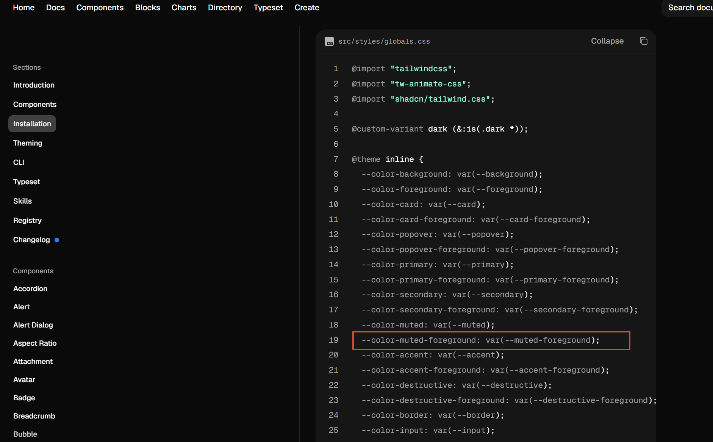

# 游戏王决斗编辑器：深浅双色主题与基础色彩自适应

本改动属于一次独立的原子化提交，旨在为整个应用建立完整的**深浅双色主题体系**（默认采用白色浅色模式），实现状态内存更新、DOM 根节点响应与本地磁盘持久化的闭环，并对全局滚动条、手牌托盘及右键菜单等基础界面的中性色彩进行深浅适配。

---

## 改动缘由与核心设计目标

- **打破单一暗黑模式限制**：原应用硬编码为深色主题，无法满足用户在明亮环境或偏好浅色界面的创作需求。本次改动引入深浅双色主题，且默认设为清爽的浅色（白色主题）。
- **DOM 与内存状态即时响应**：通过操作根节点 `document.documentElement` 动态增删 `dark` 类名，使全应用所有基于 TailwindCSS 的 `dark:` 变体和 OKLCH CSS 变量在 0 毫秒内瞬间切换，杜绝界面卡顿或重载。
- **本地持久化闭环**：用户的主题选择通过 Electron IPC 异步写入本地配置文件，在应用重启时自动读取恢复，保持体验连贯。
- **基础视图色彩中性化自适应**：修复全局滚动条在白色背景下不可见的问题，并将右键菜单、手牌托盘等边缘组件色彩收敛为自适应的中性设计基调。

---

## 各模块代码改动明细与 Diff

### **src/shared/types/ipc.ts**

- **改动缘由**：在用户配置类型定义 `AppConfig` 中，为 `theme` 字段补充明确的 JSDoc 注释，标明其支持 `'dark' | 'light'` 双模式。

```diff
 export interface AppConfig {
-  gameDirectory?: string // EDOPro / MDPro3 安装根目录
-  cdbPath?: string // 当前使用的 cards.cdb 完整路径
+  /** ygopro等的安装根目录 */
+  gameDirectory?: string
+  /** 当前使用的 cards.cdb 完整路径 */
+  cdbPath?: string
+  /** 主题 */
   theme: 'dark' | 'light'
 }
```

---

### **src/main/services/configService.ts**

- **改动缘由**：主进程配置单例服务中，将初始保底配置中的 `theme` 设为 `'light'`，确保新安装或配置文件缺失时默认提供浅色主题。

```diff
 export class ConfigService {
   private configPath: string
   private config: AppConfig = {
-    theme: 'dark'
+    theme: 'light'
   }
```

---

### **src/renderer/index.html**

- **改动缘由**：移除 `<html>` 标签上原本硬编码的 `class="dark"`，使初始骨架直接以浅色模式挂载，杜绝应用冷启动时由暗变亮的闪屏现象。

```diff
-<!doctype html>
-<html lang="zh-CN" class="dark">
+<!doctype html>
+<html lang="zh-CN">
   <head>
     <meta charset="UTF-8" />
```

---

### **src/renderer/src/stores/useConfigStore.ts**

- **改动缘由**：在配置状态中心新增 `theme: 'dark' | 'light'` 状态，提供 `setTheme` 与 `toggleTheme`。切换时同步控制 `document.documentElement` 的 `dark` 类名，并通过 IPC 持久化保存至本地磁盘，确保应用冷启动时保持用户偏好。

```diff
 interface ConfigStoreState {
   loadConfig: () => Promise<void>
   selectCdbFile: () => Promise<string | null>
   selectGameDir: () => Promise<string | null>
+  setTheme: (theme: 'dark' | 'light') => Promise<void>
+  toggleTheme: () => Promise<void>
 }

 export const useConfigStore = create<ConfigStoreState>((set, get) => ({
   config: {
-    theme: 'dark'
+    theme: 'light'
   },
   isLoaded: false,

   loadConfig: async () => {
     try {
       const cfg = await window.api.getConfig()
-      set({ config: cfg, isLoaded: true })
+      const theme = cfg.theme || 'light'
+      document.documentElement.classList.toggle('dark', theme === 'dark')
+      set({ config: { ...cfg, theme }, isLoaded: true })
     } catch (err) {
       console.error('[useConfigStore] loadConfig error:', err)
       set({ isLoaded: true })
     }
   },

+  setTheme: async (theme: 'dark' | 'light') => {
+    document.documentElement.classList.toggle('dark', theme === 'dark')
+    set((state) => ({ config: { ...state.config, theme } }))
+    await window.api.saveConfig({ theme })
+  },
+
+  toggleTheme: async () => {
+    const currentTheme = get().config.theme || 'light'
+    const nextTheme = currentTheme === 'dark' ? 'light' : 'dark'
+    await get().setTheme(nextTheme)
+  },
```

##### 为什么需要同时设计 setTheme 与 toggleTheme 两个方法

两个方法的共存源于应用中两种截然不同的用户交互场景，在架构上体现为“底层原子操作”与“上层便利封装”的分工模式：

###### 菜单栏的明确指定设值（setTheme）

在桌面下拉菜单栏（MenuBar）的“设置”子菜单中，选项是具体而明确的：

- 点击「浅色模式 (白色主题)」：明确发出将系统置为浅色的指令；
- 点击「深色模式 (黑色主题)」：明确发出将系统置为深色的指令。

在此类场景中，用户的意图是“定点设值”，无论当前处于何种主题，点击后都必须幂等地赋予目标值。此时必须依赖显式接收目标参数的 `setTheme('dark' | 'light')`。

###### 顶栏快捷按钮的一键反转（toggleTheme）

在顶栏右上角的 ☀️ / 🌙 快捷图标按钮（以及未来可能绑定的主题切换快捷键）中，用户的核心意图是“按一下就反转一次”，期望在黑白两态之间来回切换。

如果仅提供 `setTheme`，那么任何需要一键反转的 UI 组件都必须自行读取当前主题并书写 `theme === 'dark' ? 'light' : 'dark'` 的样板代码。提供无参的 `toggleTheme` 可以将这部分状态取反逻辑收拢在 store 内部，保持外部组件调用的纯净。

###### 原子方法与便利层的职责分工

在具体实现上，二者并不是平行的重复实现，而是标准的“原子底层 + 语法糖”分工：

- `setTheme` 扮演底层原子操作角色，负责所有实质性的重活：修改根节点 DOM 类名、更新 Zustand 内存状态、以及通过 IPC 异步向磁盘持久化写入配置文件；
- `toggleTheme` 仅作为上层便捷包装，负责根据当前状态推导相反值，随后直接调用 `setTheme(nextTheme)` 复用全部核心逻辑，避免逻辑散落与冗余。

---

### **src/renderer/src/assets/globals.css**

- **改动缘由**：将全局滚动条滑块的半透明背景调整为中性自适应色阶，解决浅色背景下原纯白半透明滑块完全隐形的问题。

```diff
-  /* 极简暗黑半透明滚动条 (消除原生刺眼白色滚动条) */
+  /* 极简半透明滚动条 (自适应深浅两色背景) */
   ::-webkit-scrollbar {
     width: 6px;
     height: 6px;
   }
   ::-webkit-scrollbar-track {
     background: transparent;
   }
   ::-webkit-scrollbar-thumb {
-    background: rgba(255, 255, 255, 0.15);
+    background: rgba(140, 140, 140, 0.25);
     border-radius: 9999px;
   }
   ::-webkit-scrollbar-thumb:hover {
-    background: rgba(255, 255, 255, 0.35);
+    background: rgba(140, 140, 140, 0.5);
   }
```

---

### **src/renderer/src/components/Board/CardContextMenu.tsx**

- **改动缘由**：将卡片右键菜单各项原本杂乱的彩色图标统一收敛为中性次要色 `text-muted-foreground`，契合专业设计系统并消除在浅色主题下色彩刺眼的问题。

```diff
   const handItems: MenuItemConfig[] = isHand
     ? [
         {
-          icon: <Eye className="w-3.5 h-3.5 text-blue-400" />,
+          icon: <Eye className="w-3.5 h-3.5 text-muted-foreground" />,
           label: '表侧表示 (公开手牌)',
           action: setPos(CardPosition.FACEUP)
         },
         {
-          icon: <EyeOff className="w-3.5 h-3.5 text-amber-400" />,
+          icon: <EyeOff className="w-3.5 h-3.5 text-muted-foreground" />,
           label: '里侧表示 (未公开手牌)',
           action: setPos(CardPosition.FACEDOWN)
         },
         {
-          icon: <ArrowLeftRight className="w-3.5 h-3.5 text-emerald-400" />,
+          icon: <ArrowLeftRight className="w-3.5 h-3.5 text-muted-foreground" />,
           label: `转移至${card.controller === 0 ? '对方手牌' : '我方手牌'}`,
           action: moveTo(CardLocation.HAND, card.controller === 0 ? 1 : 0)
         }
         
         
         const monsterItems: MenuItemConfig[] = isMonsterZone
     ? [
         {
-          icon: <Swords className="w-3.5 h-3.5 text-amber-400" />,
+          icon: <Swords className="w-3.5 h-3.5 text-muted-foreground" />,
           label: '表侧攻击表示',
           action: setPos(CardPosition.FACEUP_ATTACK)
         },
         {
-          icon: <Shield className="w-3.5 h-3.5 text-blue-400" />,
+          icon: <Shield className="w-3.5 h-3.5 text-muted-foreground" />,
           label: '表侧守备表示',
           action: setPos(CardPosition.FACEUP_DEFENSE)
         },
         {
-          icon: <EyeOff className="w-3.5 h-3.5 text-neutral-400" />,
+          icon: <EyeOff className="w-3.5 h-3.5 text-muted-foreground" />,
           label: '里侧守备表示',
           action: setPos(CardPosition.FACEDOWN_DEFENSE)
         }
         
         
            const spellTrapItems: MenuItemConfig[] = isSpellTrapZone
     ? [
         {
-          icon: <Swords className="w-3.5 h-3.5 text-amber-400" />,
+          icon: <Swords className="w-3.5 h-3.5 text-muted-foreground" />,
           label: '表侧表示',
           action: setPos(CardPosition.FACEUP_ATTACK)
         },
         {
-          icon: <RotateCw className="w-3.5 h-3.5 text-purple-400" />,
+          icon: <RotateCw className="w-3.5 h-3.5 text-muted-foreground" />,
           label: '里侧盖放',
           action: setPos(CardPosition.FACEDOWN)
         }
         
         
         
            const commonDestItems: MenuItemConfig[] = [
     ...(card.location !== CardLocation.GRAVE
       ? [
           {
-            icon: <ArrowDownToLine className="w-3.5 h-3.5 text-stone-400" />,
+            icon: <ArrowDownToLine className="w-3.5 h-3.5 text-muted-foreground" />,
             label: '送去墓地',
             action: moveTo(CardLocation.GRAVE)
           }
         ]
       : []),
     ...(card.location !== CardLocation.REMOVED
       ? [
           {
-            icon: <Ban className="w-3.5 h-3.5 text-orange-400" />,
+            icon: <Ban className="w-3.5 h-3.5 text-muted-foreground" />,
             label: '除外',
             action: moveTo(CardLocation.REMOVED)
           }
         ]
       : []),
     ...(card.location !== CardLocation.HAND
       ? [
           {
-            icon: <Layers className="w-3.5 h-3.5 text-cyan-400" />,
+            icon: <Layers className="w-3.5 h-3.5 text-muted-foreground" />,
             label: '移回手牌',
             action: moveTo(CardLocation.HAND)
           }
```

#### 语义颜色 text-muted-foreground 的来源与机制

- **为什么 TailwindCSS 官方默认颜色文档找不到它**：Tailwind 官方核心预设色板均为具象色相（如 `slate`、`zinc`、`blue`、`red`），而 `muted-foreground` 属于主流 UI 规范 **shadcn/ui** 定义的「语义化设计变量（Semantic Tokens）」；



- 在 `@theme inline` 块中通过 `--color-muted-foreground: var(--muted-foreground);` 将 CSS 变量接入 Tailwind 体系，自动派生出 `text-muted-foreground`、`bg-muted-foreground` 等工具类；
- **浅色模式（:root）**：映射为中深灰色 `oklch(0.556 0 0)`，在白色菜单背景上清晰呈现且不抢夺视觉焦点；
- **深色模式（.dark）**：映射为中浅灰色 `oklch(0.708 0 0)`，在黑色菜单背景上柔和不刺眼；

---

### **src/renderer/src/components/Board/components/HandTray.tsx**

- **改动缘由**：使手牌托盘面板背景、边框、双方手牌标签与空槽提示色系自适应深浅双模式，提升在浅色主题下的辨识度。

```diff
   return (
     <div
-      className={`w-full max-w-5xl shrink-0 p-2 rounded-xl bg-card/60 backdrop-blur-md border shadow-lg flex flex-col gap-1.5 ${
-        isOpponent ? 'border-red-500/25' : 'border-blue-500/25'
+      className={`w-full max-w-5xl shrink-0 p-2 rounded-xl bg-card/85 dark:bg-card/60 backdrop-blur-md border shadow-lg flex flex-col gap-1.5 ${
+        isOpponent ? 'border-red-500/30' : 'border-blue-500/30'
       }`}
     >
       <div className="flex items-center justify-between text-xs px-1">
         <div className="flex items-center gap-2">
           <span
-            className={`font-bold tracking-wide text-xs ${isOpponent ? 'text-red-400' : 'text-blue-400'}`}
+            className={`font-bold tracking-wide text-xs ${
+              isOpponent ? 'text-red-600 dark:text-red-400' : 'text-blue-600 dark:text-blue-400'
+            }`}
           >
             {isOpponent ? '对方手牌' : '我方手牌'} ({handCards.length} 张)
           </span>
           <Badge
             variant="outline"
             className={`text-[10px] px-1.5 py-0 h-4 font-medium ${
               isOpponent
-                ? 'bg-red-950/60 text-red-300 border-red-500/30'
-                : 'bg-blue-950/60 text-blue-300 border-blue-500/30'
+                ? 'bg-red-500/15 text-red-600 dark:bg-red-950/60 dark:text-red-300 border-red-500/30'
+                : 'bg-blue-500/15 text-blue-600 dark:bg-blue-950/60 dark:text-blue-300 border-blue-500/30'
             }`}
           >
             {isOpponent ? '剧情 / 应对' : '我方'}
           </Badge>
           
           
           
           {/* 手牌横向排布流 (卡多时横向滚动，纵向高度恒定) */}
       <div
         onDragOver={handleDragOver}
         onDrop={handleDrop}
-        className={`h-[114px] w-full px-2 py-1 rounded-lg bg-black/40 border border-dashed flex items-center gap-2 overflow-x-auto shadow-inner transition-colors ${
+        className={`h-[114px] w-full px-2 py-1 rounded-lg bg-muted/30 dark:bg-black/40 border border-dashed flex items-center gap-2 overflow-x-auto shadow-inner transition-colors ${
           isOpponent
             ? 'border-red-500/25 hover:border-red-500/50'
             : 'border-blue-500/25 hover:border-blue-500/50'
         }`}
       >
       
       
                {handCards.length === 0 && (
           <div
             className={`w-full h-full flex items-center justify-center text-xs gap-1.5 pointer-events-none ${
-              isOpponent ? 'text-red-300/50' : 'text-blue-300/50'
+              isOpponent ? 'text-red-600/60 dark:text-red-300/50' : 'text-blue-600/60 dark:text-blue-300/50'
             }`}
           >
             <Plus
-              className={`w-3.5 h-3.5 ${isOpponent ? 'text-red-400/50' : 'text-blue-400/50'}`}
+              className={`w-3.5 h-3.5 ${
+                isOpponent ? 'text-red-600/70 dark:text-red-400/50' : 'text-blue-600/70 dark:text-blue-400/50'
+              }`}
             />
             <span>
```
