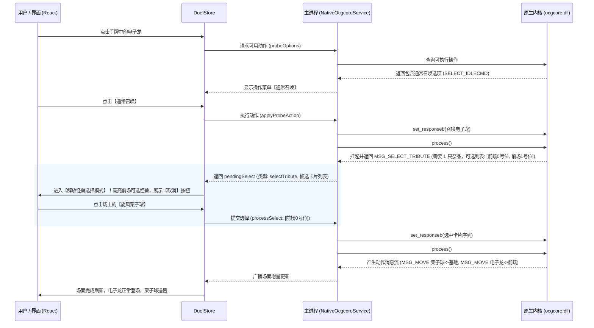

# 原生 ygocore（C++ ocgcore）架构决策与落地规范

## 1. 决策背景与核心矛盾

游戏王 OCG 规则与卡池处于高频演进中，官方每月更新补充包、新大师规则补充细则及卡片脚本 Lua 接口。在本项目（YGO Duel Editor）中，前期引入了社区 npm 包 `ocgcore-wasm` 作为规则引擎，但遇到了关键瓶颈：

1. **版本停滞与卡池脱节**：npm 上的第三方 `ocgcore-wasm` 已数月未更新，缺失了近期官方新增的底层 Lua 宏定义（如 `EFFECT_ADD_CARD_TYPE`）、手牌公开状态刷新逻辑及新补充包核心脚本支持。
2. **官方核心极速演进**：本地克隆的官方最新仓库 `Fluorohydride/ygopro-core`（`D:\Codes\ygopro-core`）由官方团队高频维护（最新提交距今仅数小时）。
3. **架构自决权**：若长期绑定第三方未经维护的 WASM 封装层，将受制于人且无法自发修复内核问题；转向官方原生 `ygopro-core`，可实现代码拉取即生效的掌控力。

---

## 2. 核心概念与系统边界

### 2.1 ygocore / ocgcore / ygopro 的关系
- **ocgcore（亦称 ygocore）**：位于 `Fluorohydride/ygopro-core`，是纯 C++ 编写的无界面（Headless）规则计算内核，内嵌 Lua 5.3 解释器。负责效果处理、时点裁定、连锁演算与消息包生成，无任何图形或音频依赖。
- **gframe**：原版 YGOPRO 的 Irrlicht 3D 渲染与客户端 GUI 窗口系统。
- **YGO Duel Editor**：本项目作为 Electron 桌面端，以 React 构建现代化创作界面，完全剥离 `gframe`，直接驱动底层 `ocgcore`。

### 2.2 运行环境与载体选型
本项目是基于 **Electron** 开发的桌面应用，其主进程（Main Process）是真正的 Node.js 环境，具备直接调用操作系统底层动态链接库的完备能力：
- **方案决策**：在 Windows 端采用 MSVC 将 `D:\Codes\ygopro-core` 编译为原生 64 位动态链接库 `ocgcore.dll`，在 Electron 主进程通过现代高性能 FFI 库（`koffi`）加载，完全替代第三方的 `ocgcore-wasm`。

---

## 3. 技术方案设计：Native DLL + Node.js FFI

### 3.1 动态库导出规范（C API）
`ygopro-core` 的 `ocgapi.h` 提供了标准的 `extern "C"` 接口，核心导出清单：
- `create_duel(seed)` / `create_duel_v2(seed_sequence)`：创建决斗实例，返回句柄 `pduel`
- `start_duel(pduel, options)`：启动对局，传入规则模式（MR5、Speed、Rush 等）
- `end_duel(pduel)`：销毁对局，回收 C++ 内存
- `set_player_info(pduel, playerid, lp, startcount, drawcount)`：初始化玩家 LP 与手牌
- `new_card(pduel, code, owner, playerid, location, sequence, position)`：摆放卡片
- `process(pduel)`：引擎单步步进演算，返回执行状态标识
- `get_message(pduel, buf)`：获取当前步引擎产生的结构化二进制消息包流
- `set_responseb(pduel, buf)` / `set_responsei(pduel, val)`：向引擎回传玩家的操作响应
- `set_script_reader(f)` / `set_card_reader(f)`：注册脚本与卡片数据读取回调

### 3.2 自动化编译机制
基于 `ygopro-core` 源码自带的 `premake/dll.lua` 与系统环境已安装的 Visual Studio（MSVC）：
1. 自动配置 Lua 依赖环境与 premake 配置；
2. 产出 64 位 Release 版本 `ocgcore.dll`；
3. 输出至项目指定目录（如 `resources/engine/bin/x64/ocgcore.dll`）；
4. 提供脚本 `scripts/build-native-core.ps1`，当官方上游源码更新时，一键重新编译。

### 3.3 Node.js FFI 桥接（`koffi`）
- 选用 `koffi` 替代传统 `ffi-napi` / `node-gyp`。`koffi` 具备极致解析性能（近原生 C 调用），且不受 Electron 版本升级导致的 V8 ABI 不兼容影响。
- 主进程服务模块 `NativeOcgcoreService` 封装 C 指针与内存管理，对渲染进程提供类型安全的 IPC 通信。

---

## 4. 游戏王规则与操作一致性保障机制

### 4.1 核心问题复盘：为什么此前电子龙上场无需祭品？
在此前实现中，电子龙（5星无通常召唤自肃怪兽）召唤时直接跳过祭品步骤，**根源并非内核计算错误，而是客户端交互循环（Message Loop）未能闭环**：
1. 引擎在主要阶段 1 发出 `MSG_SELECT_IDLECMD`，指示电子龙可通常召唤；
2. 玩家点击召唤后，引擎根据 5 星规则判断场上需要 1 只怪兽作为解放祭品；
3. 引擎不会立刻完成登场，而是进入**挂起状态（Waiting State）**，向客户端返回 `MSG_SELECT_TRIBUTE`（包含可选祭品序列、最小与最大要求数量）；
4. 此时客户端必须进入“祭品选择二级交互模式”，高亮可选怪兽，由玩家完成点选或取消；
5. 先前流程直接跳过了这一交互请求，导致未能正确执行祭品献祭。

### 4.2 严格遵循 OCG 规则的交互状态机

---

## 5. 实施路线图

1. **阶段一：动态库编译与落地**
   - 编写 `scripts/build-native-core.ps1`，自动化调用 VS 工具链从 `D:\Codes\ygopro-core` 编译产出 64 位 `ocgcore.dll`。
   - 放置并管理原生二进制文件。

2. **阶段二：Node.js FFI 桥接层集成**
   - 引入 `koffi`，在主进程构建 `NativeOcgcoreService`。
   - 实现 `set_card_reader`（对接项目内置 CDB 与自定义卡数据库）与 `set_script_reader`（对接 Lua 脚本与 `script.zip`）。
   - 实现二进制消息包解包器（Message Parser），将原版 C 消息包转化为 TypeScript 领域事件。

3. **阶段三：二级选择交互系统（Pending Select UI）**
   - 完善针对 `SELECT_TRIBUTE`（祭品选择）、`SELECT_CARD`（效果对象选择）、`SELECT_EFFECTYN`（是否发动确认）、`SELECT_CHAIN`（连锁响应）的前端高亮与选择交互。
   - 确保全流程在 `useDuelStore` 中具有完备的状态管理与撤销/重做支持。

4. **阶段四：双轨平稳过渡与验证**
   - 验证原生 DLL 驱动下的所有规则裁定；
   - 验证 `generateLuaScript` 导出与回放一致性；
   - 清理已废弃的第三方 WASM 依赖。
