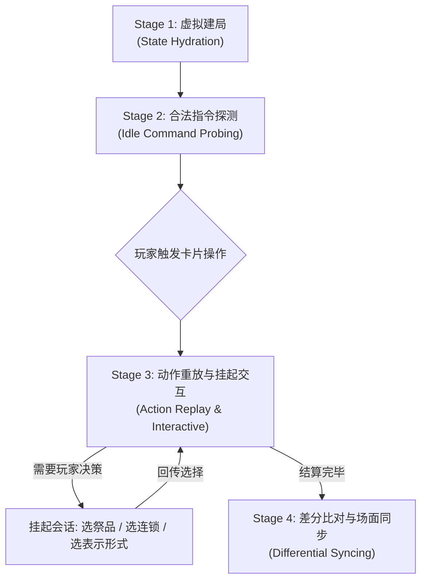

# YGO Duel Editor 规则校验架构与 ocgcore-wasm 实现文档

## 1. 概述与核心依赖

在游戏王对局编排与残局设计中，卡片效果结算（时点、诱发、连锁、对象合法性）与召唤规则（祭品解放、超量/同调/连接素材要求、表示形式）极其复杂。本项目并未在前端手写规则校验逻辑，而是直接接入了 **`ocgcore-wasm`**。

### 1.1 依赖本质
- **`ocgcore-wasm`** 是基于 Emscripten 将官方 **C++ ocgcore**（即桌面端 YGOPRO / EDOPro 底层使用的开源规则内核）编译而成的 WebAssembly 运行时。
- 其内部运行的是与 YGOPRO 官方完全同源的决斗状态机和 Lua 脚本解释器。
- 本项目不内置任何卡片脚本与 CDB 数据；引擎运行时通过宿主回调（`handleCardScript` 与 `handleCardData`）动态读取用户本地游戏目录（`cards.cdb`、`script/c{code}.lua` 以及 `.zip` 扩展包）。

---

## 2. 总体架构设计

规则校验系统采用**主进程虚拟镜像驱动、渲染层单向数据流与差分同步**的架构：

```
┌────────────────────────────────────────────────────────┐
│                   Renderer (React SPA)                 │
│  useRuleCheckStore ──► CardCommandMenu / ActionIntentBar │
│           ▲                                 │          │
│           │ (合法指令 probe)                 │ (执行动作)│
└───────────┼─────────────────────────────────┼──────────┘
            │               IPC               │
┌───────────┼─────────────────────────────────▼──────────┐
│           │         Main (Node.js)                     │
│    ruleCheckService (状态机推进、交互会话与差分比对)       │
│           ▲                                 │          │
│           │                                 ▼          │
│      ocgcoreService (WASM 对局实例与 Lua 脚本桥接)       │
└────────────────────────────────────────────────────────┘
```

### 2.1 关键模块分工
1. **`src/main/services/ocgcoreService.ts`**：
   - 管理 `ocgcore-wasm` 单例生命周期与版本协商。
   - 解析本地游戏目录路径，提供 Lua 脚本读取与 zip 归档缓存。
   - 根据传入的 `DuelPuzzleState` 还原对局，挂载卡片基础属性与脚本。
2. **`src/main/services/ruleCheckService.ts`**：
   - **合法动作探测**：将引擎推进至等待态，提取当前合法的操作集合（`EngineProbeOptionsResult`）。
   - **单步动作重放**：执行玩家选定的动作，监听引擎后续的玩家决策请求（`pendingSelect`）。
   - **多轮会话管理**：对需要交互的流程（祭品、连锁、分支）维护会话池（`sessions`）。
   - **差分比对**：在动作执行完毕后，对比执行前后的场面差异（`missing`、`placedCard`、`counters`、`gained`）。
3. **`src/renderer/src/stores/useRuleCheckStore.ts`**：
   - 防抖监听棋盘场面与阶段变更，向主进程请求最新的合法动作。
4. **`src/renderer/src/components/Board/CardCommandMenu.tsx`**：
   - 紧凑型金属质感操作菜单，严格依据引擎探测结果动态展示/隐藏指令按钮。
5. **`src/renderer/src/stores/useDuelStore.ts`**：
   - 维护动作发起、延迟登场暂存、解放目标选定与录像流水记录。

---

## 3. 四阶段生命周期与数据流

整个规则交互生命周期由 4 个连续阶段构成：



### Stage 1: 虚拟建局与状态镜像 (State Hydration)
当需要探测或执行动作时，系统会基于当前编辑器的 `DuelPuzzleState` 实时克隆一份轻量级引擎对局：
1. **阵营归一化 (`swapSides`)**：ocgcore 规定当前回合玩家必须为 `controller: 0`。若编辑器当前处于对手回合（`turnPlayer === 1`），主进程自动翻转场面数据（交换双方手牌/场上卡片的归属），确保引擎内部以主角视角推进。
2. **阶段绕过 (`skipDrawStandby`)**：编排残局时不需要触发抽卡阶段和准备阶段的常规逻辑，建局时直接快进至主要阶段 1（M1）。
3. **指示物还原 (`seedCounters`)**：将编辑器中卡片已有的指示物数量灌注到引擎卡片实例中。

### Stage 2: 合法指令探测 (Idle Command Probing)
通过 `duelProcess` 推进引擎至顶层等待状态（`TopLevelWait`）：
- **主要阶段空闲指令 (`SELECT_IDLECMD`)**：引擎直接计算出当前所有卡片合法的操作：
  - `idle.summon`：可通常召唤的怪兽列表；
  - `idle.spSummon`：可特殊召唤的怪兽列表；
  - `idle.monsterSet` / `idle.spellSet`：可盖放的卡片列表；
  - `idle.activate`：可发动的魔法/陷阱/怪兽效果（包含 `effectIndex` 与效果描述 `description`）；
  - `idle.posChange`：可变更表示形式的怪兽；
  - `idle.toBp` / `idle.toEp`：是否满足进入战斗阶段或结束阶段的条件。
- **战斗阶段指令 (`SELECT_BATTLECMD`)**：
  - `battle.attacks`：可攻击的怪兽列表（及是否可直接攻击玩家）。
这些数据回传到前端后，卡片操作菜单即刻完成精准置灰与过滤。

### Stage 3: 动作重放与挂起交互 (Action Replay & Interactive)
当玩家点击操作（例如手牌中 5 星怪兽点击「召唤」）时，系统采用 **延迟登场（Deferred Placement）** 机制：

#### 为什么必须采用延迟登场？
在早期的实现中，点击召唤会先同步执行 `moveCard` 把怪兽放到场上，再通知引擎重放。这种做法存在根本缺陷：
- 5 星及以上怪兽需要 1 只或更多祭品，ocgcore 会挂起并要求玩家选择祭品（`SELECT_TRIBUTE`）；
- 如果怪兽已经提前落在怪兽区，场上就会出现“未选祭品怪兽已上场”的非法状态；
- 若玩家此时中途取消，怪兽已被非法挪动；
- 如果场上 5 格已满，先挪动还会导致格子冲突。

#### 当前延迟登场流程：
1. **意图暂存**：怪兽**依然保留在手牌**中，登场意图打包为 `summonPlacement: { instanceId, toLocation, toSequence, position }`。
2. **引擎执行**：主进程响应 `SELECT_IDLECMD` 动作。
3. **引擎挂起 (`parked`)**：
   - ocgcore 判定该通常召唤需要祭品，发出 `SELECT_TRIBUTE` 询问；
   - 主进程挂起决斗，生成 `sessionId` 返回前端 `pendingEngineSelect`；
   - 前端识别 `prompt.kind === 'TRIBUTE'`，在场上将所有可选祭品亮起绿色目标光环（`role === 'legal'`），非祭品暗化；
   - 底部操作条显示“【请选择祭品】1 张”及“取消”按钮。
4. **决策回传**：
   - 玩家点击场上合法怪兽，`duelProbeSelect` 提交祭品索引；
   - 引擎扣减祭品将其送入墓地，正式执行怪兽登场；
   - 若玩家点击取消，引擎取消操作，怪兽全程安全保留在手牌中。

### Stage 4: 差分比对与场面同步 (Differential Syncing)
动作结算后，主进程执行 `finalizeAction`：
1. **落点追踪 (`placedCard`)**：对比动作前后场上新增的卡片。即使在场上 5 格全满时进行解放召唤，引擎会将怪兽放入刚刚被解放怪兽腾出的格中，`placedCard.sequence` 会精准指引怪兽落入该格。
2. **离场追溯 (`missing`)**：比对执行前位于场上但在执行后不在原位的卡片。若进入墓地（如解放的祭品、被破坏的卡），记录 `toLocation: CardLocation.GRAVE`，前端自动将其送墓。
3. **指示物增减 (`counters`)** 与 **手牌增减 (`gained`)**：自动同步效果带来的抽卡/检索与指示物变化。
4. **状态入库**：将以上变化原子化应用到 `useDuelStore`，并记录一步完整的录像日志（`ReplayLogEntry`）。

---

## 4. 特殊交互场景与对应机制

| 引擎询问类型 | 消息代码 | 交互形式 | 实现机制 |
| :--- | :--- | :--- | :--- |
| **上级召唤解放** | `SELECT_TRIBUTE` | 棋盘现场交互 | 召唤卡留手牌，场上祭品高亮光环，点击直接解放送墓 |
| **效果连锁询问** | `SELECT_CHAIN` | 底部意图提示条 | 提示“要发动【卡名】的效果吗？”，提供“连锁”或“不发动” |
| **诱发效果确认** | `SELECT_EFFECTYN` | 底部意图提示条 | 提示是否发动某卡效果，提供“是/否”按钮 |
| **表示形式选择** | `SELECT_POSITION` | 底部意图提示条 | 特殊召唤时提示选择“表侧攻击”或“表侧守备” |
| **多分支效果选择**| `SELECT_OPTION` | 弹窗 / 下拉菜单 | 提取 CDB 描述文字，列出各分支文字供玩家点选 |
| **堆叠区选卡** | `SELECT_CARD` (墓地/卡组/额外) | 列表弹窗 (`EngineSelectModal`) | 针对堆叠卡片，弹窗展示缩略图供玩家勾选确认 |

---

## 5. 自建卡与自由编排双轨兼容

作为剧情编排工具，编辑器必须支持玩家自定义的自建卡（无官方 Lua 脚本）：

1. **自动识别**：
   - 通过 `isCustomCardId(code)` 或 `card.isCustom` 判定自建卡。
2. **双轨策略**：
   - **官方卡片（有脚本）**：严格按照 ocgcore 的 probe 结果开放操作菜单与解放结算，提供 100% 官方规则还原度；
   - **自建卡（无脚本）**：自动降级为宽容模式（Fallback Mode），开放全部召唤、特殊召唤、盖放操作，允许玩家自由拖拽与落子；
   - **全局开关**：在“对局设置”中关闭规则校验后，全场切换为纯手工自由编排模式。

---

## 6. 录像导出一致性保障

在 `exportReplay` 导出 YRP / Lua 脚本时，主进程会严格按顺序重放录像日志中的每一个动作（`EngineProbeAction`）及每一步的交互选择记录（`selections`），确保在真实 ocgcore 环境下能够 100% 重现用户的编排结果。
